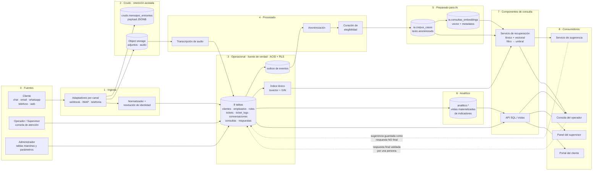

# Punto 10 — Arquitectura de datos

**Corresponde a:** sección 12 de `docs/informe.md` ("Propuesta de arquitectura de datos")
**Antecedente:** este punto continúa las decisiones del punto 9 (`docs/09_datos_semiestructurados_no_estructurados_vectorial.md`) y de las secciones 6 y 7 del informe. No las repite: las ubica en un flujo.

---

## 1. Alcance y punto de partida

### 1.1 Qué existe hoy

Antes de proponer una arquitectura conviene ser preciso sobre cuánto de ella está construido, porque la respuesta cambia la propuesta:

| Componente arquitectónico | Estado real |
|---|---|
| Fuentes de datos (5 canales) | **No existe ingesta.** El canal solo se registra como valor de `tickets.canal_origen` |
| Procesos de carga | **No existen.** La única carga es `data/03_datos_ejemplo.sql`, un `INSERT` manual |
| Almacenamiento operacional | **Existe:** 8 tablas, 9 índices, 1 índice único parcial, 1 vista, en PostgreSQL 16 |
| Almacenamiento analítico | **No existe como capa.** Hay 8 consultas SQL sueltas en `db/consultas/05_consultas_representativas.sql` que calculan los indicadores en caliente |
| Datos crudos | **No se conservan.** Nada guarda el mensaje original de ningún canal |
| Datos procesados | **No existen.** Ni anonimización, ni transcripción, ni normalización |
| Datos preparados para IA | **Diseñados, no construidos.** `vectorial/modelo_vectorial.md` es una propuesta; no hay `CREATE EXTENSION vector` en ningún script |
| Componentes de consulta | **Parcial:** la vista `vw_estado_actual_tickets` y las 8 consultas. No hay API, ni FTS, ni servicio de recuperación |
| Consumidores | **No existen.** Cero código de aplicación en el repositorio |
| Control de acceso | **Implementado para el núcleo** (`db/fisico/05_seguridad_permisos.sql`, sección 13 del informe): roles nativos, `ENABLE ROW LEVEL SECURITY` y `CREATE POLICY` sobre las 8 tablas, probado contra Postgres real. Falta solo sobre `consultas_embeddings`, que no existe físicamente |
| Infraestructura | `docker-compose.yml`: PostgreSQL (`pgvector/pgvector:pg16`) + pgAdmin. Un solo contenedor de base |

En términos de arquitectura: **está construida la capa operacional y nada más**. Todo lo que sigue es propuesta, y por eso el criterio rector de este punto es que **cada capa se pueda incorporar por separado y el sistema funcione sin las que faltan**.

### 1.2 Criterio de diseño adoptado

Tres reglas que gobiernan todas las decisiones que siguen:

1. **Una sola fuente de verdad.** El núcleo relacional. Todo lo demás es derivado y **reconstruible desde él**. Ninguna capa aguas abajo puede contener información que no se pueda regenerar.
2. **Ninguna capa derivada es indispensable para atender un caso.** Si el índice vectorial se cae, el operador sigue atendiendo. Si las vistas analíticas están desactualizadas, el ticket sigue avanzando. Esto no es tolerancia a fallos por gusto: es la condición para poder construir la arquitectura por partes.
3. **El dato personal se degrada al avanzar.** El texto es identificable en el crudo, controlado por RLS en el operacional, y **anonimizado antes de entrar a la capa de IA**. La dirección del flujo y la dirección de la desidentificación son la misma.

---

## 2. Diagrama de arquitectura



**Lectura del diagrama en una frase:** el dato entra por un canal, se guarda crudo para poder reprocesarlo, se normaliza hacia el núcleo transaccional que es la única fuente de verdad, y de ahí salen tres derivados independientes —el índice léxico, el corpus anonimizado con sus vectores, y las vistas de indicadores— que alimentan a los cuatro consumidores; la respuesta que el operador valida vuelve al núcleo y, desde ahí, al corpus.

Las dos flechas punteadas son el **lazo de retroalimentación**: es lo que el enunciado llama "conservar el historial de interacciones para mejorar la atención futura", y es la única parte de la arquitectura que es un ciclo y no un flujo.

---

## 3. Las capas, una por una

### 3.1 Fuentes de datos

| Fuente | Qué aporta | Naturaleza | Existe hoy |
|---|---|---|---|
| Cliente por **chat web** | texto en tiempo real, sesión, user-agent | texto + metadatos técnicos | canal registrado, contenido no |
| Cliente por **email** | asunto, cuerpo, cabeceras, **adjuntos** | texto + binarios | canal registrado |
| Cliente por **whatsapp** | mensajes, `wa_id`, posibles imágenes | texto + binarios | canal registrado |
| Cliente por **telefono** | **audio de la llamada** | binario → requiere transcripción | canal registrado (ticket 5); **la transcripción se presupone y no está modelada** |
| Cliente por **web** (formulario) | campos estructurados + texto libre | mixto | canal registrado |
| **Operador** | respuesta final, cambios de estado, derivaciones | estructurado + texto libre | sí (`respuestas`, `ticket_logs`) |
| **Supervisor** | reasignaciones, auditoría | estructurado | sí (implícito en `ticket_logs`) |
| **Administrador** | roles, canales habilitados, parámetros | estructurado + semiestructurado | parcial: `roles` sí, **tabla de parámetros no existe** |
| **Sistema de IA** | sugerencias de respuesta | texto libre + metadatos de generación | sí como bandera (`es_humano = FALSE`) |
| **Base de conocimiento / FAQ** | documentos curados | documentos largos | **no existe** — *hipotético* (punto 9, 4.3) |

Observación arquitectónica relevante: **las cinco fuentes de cliente convergen en un único esquema**. No son cinco sistemas heterogéneos que haya que integrar, son cinco formatos de entrada del mismo tipo de hecho ("un cliente preguntó algo"). Esto es decisivo para la sección 8: el principal motivo por el que se construye un Data Warehouse —integrar fuentes con modelos incompatibles— **no se da en este caso**.

### 3.2 Procesos de carga o ingesta

Tres pasos, en este orden:

**a) Adaptador por canal.** Un componente por canal que habla el protocolo nativo (webhook de WhatsApp Business, IMAP o webhook del proveedor de correo, WebSocket del chat, API de la telefonía, `POST` del formulario) y produce un evento uniforme: `{canal, identificador_externo, texto, adjuntos[], metadatos{}, recibido_en}`. Es el único lugar del sistema que conoce las particularidades de cada canal; **todo lo que está aguas abajo es agnóstico del canal**, y esa frontera es lo que permite agregar un canal nuevo sin tocar el modelo (ver 3.4, `metadatos_canal JSONB`).

**b) Resolución de identidad.** El paso más delicado y el que el modelo actual da por resuelto. La sección 1 del informe dice que el cliente "se identifica aportando DNI, email o teléfono" y que sus datos "están validados al momento de generar el caso" — pero `tickets.id_cliente` es `NOT NULL`, así que **el modelo no admite un ticket cuyo cliente todavía no se pudo identificar**. En la realidad de un canal como WhatsApp o teléfono, lo primero que llega es un número que puede no estar en `clientes`. Hay tres salidas posibles:

| Opción | Costo | Evaluación |
|---|---|---|
| Rechazar el contacto hasta identificar al cliente | ninguno en el esquema | Inaceptable operativamente: se descarta un contacto real |
| Crear un cliente provisional con datos mínimos | ensucia `clientes` con registros incompletos, y `dni`/`email` son `UNIQUE NOT NULL` — no hay valor válido para poner | Rompe las restricciones existentes |
| **Retener el mensaje en la capa cruda hasta identificar, y crear el ticket recién entonces** | requiere la capa cruda, que de todos modos se justifica por otras razones (3.3) | **Adoptada.** El mensaje no se pierde, el núcleo no se ensucia, y la identificación puede completarse de forma asíncrona o pidiendo el dato al cliente |

Esto muestra por qué la capa cruda no es un lujo: **es lo que permite que el núcleo mantenga sus restricciones estrictas sin perder datos de entrada**.

**c) Escritura transaccional al núcleo.** Una sola transacción crea o recupera el `ticket`, abre la `conversacion` si hace falta, inserta la `consulta`, escribe el primer `ticket_log` con estado `abierto`, y —punto clave— escribe el evento en la **tabla outbox**. Que el evento se escriba en la misma transacción que el hecho es lo que garantiza que no puede haber un caso registrado cuyo procesamiento posterior se perdió.

**Sobre la orquestación**, tres alternativas y por qué elijo la segunda:

| Mecanismo | Por qué sí / por qué no |
|---|---|
| Triggers + `LISTEN`/`NOTIFY` | Simple, pero `NOTIFY` **no es persistente**: si no hay oyente conectado, el aviso se pierde. Inaceptable para disparar una indexación |
| **Tabla outbox + worker que la consume** | **Adoptada.** El evento se escribe en la misma transacción que el dato (no se puede perder), el worker es reintentable e idempotente vía `hash_contenido`, y **no agrega ninguna pieza de infraestructura**: es una tabla más en el PostgreSQL que ya existe |
| Cola externa (Kafka, RabbitMQ) | Resuelve el mismo problema con un broker más que desplegar, respaldar y monitorear. A este volumen es costo sin beneficio, en la misma línea con que la sección 7.2 descartó Cassandra |

### 3.3 Datos crudos

**Qué se guarda:** el payload original de cada mensaje entrante, tal como lo entregó el canal, en `crudo.mensajes_entrantes(id, canal, identificador_externo, payload JSONB, uri_binarios[], recibido_en, procesado_en, hash)`; y los binarios (adjuntos, grabaciones) en **almacenamiento de objetos externo**, no en la base.

**Por qué se justifica, con tres razones concretas y no genéricas:**

1. **Reproceso de la anonimización.** El anonimizador es un componente que va a mejorar: hoy detecta DNI, email y teléfono; mañana detectará CBU o números de tarjeta. Cuando mejore, hay que **volver a anonimizar el histórico**, y para eso hace falta el texto original. Sin capa cruda, cada mejora del anonimizador solo se aplica hacia adelante y el corpus viejo queda con fugas permanentes.
2. **Reproceso de la transcripción.** El canal `telefono` produce audio. La transcripción de hoy tiene una tasa de error; la de dentro de un año será mejor. Sin el audio guardado, la calidad de esos casos queda congelada para siempre.
3. **Auditoría y disputa.** Ante un reclamo sobre qué dijo exactamente el cliente, `consultas.pregunta` es ya una versión normalizada y —en el caso telefónico— una interpretación. El original es la evidencia.

**Por qué NO es un Data Lake:** es una tabla append-only en el mismo PostgreSQL más un bucket de objetos. No hay catálogo, no hay schema-on-read, no hay motor de consulta distribuido, y **nadie consulta esta capa analíticamente**. Se escribe una vez, se lee para reprocesar, y se purga. Llamarlo lake sería confundir un buzón con un almacén.

**Dos decisiones que esta capa obliga a tomar explícitamente:**

- **Retención acotada** (propuesta: 90 días para el payload de texto, más para el audio si hay obligación legal). El crudo es la capa **con más datos personales y menos control de acceso útil**: contiene el texto sin anonimizar de todos los clientes. Guardarlo indefinidamente es acumular riesgo sin beneficio, porque las tres razones de arriba tienen ventana temporal.
- **Acceso más restringido que el operacional, no menos.** Es contraintuitivo: la capa "menos importante" del flujo es la que necesita permisos más duros. Solo el worker de procesamiento y, con auditoría explícita, el administrador. Ningún operador, ningún supervisor, **ninguna aplicación de consulta**.

### 3.4 Almacenamiento operacional

**Es la capa que ya existe y no cambia de naturaleza:** las 8 tablas en PostgreSQL, con integridad referencial, `CHECK` de dominio cerrado, `ON DELETE RESTRICT`, borrado lógico y consistencia fuerte. Es la única fuente de verdad y el único lugar donde un dato se escribe por primera vez de forma autoritativa.

Las adiciones que el punto 9 propuso se ubican todas aquí:

| Adición | Capa | Rol arquitectónico |
|---|---|---|
| `tickets.metadatos_canal JSONB` | operacional | Absorbe la variabilidad de los 5 canales sin propagarla al esquema |
| `respuestas.metadatos_generacion JSONB` | operacional | Traza de auditoría de cada sugerencia: qué modelo, qué casos recuperó |
| `respuestas.fecha TIMESTAMPTZ` | operacional | **Hoy no existe** y sin ella no hay recencia ni orden temporal de respuestas |
| `conversaciones.comentario TEXT` | operacional | Reseña textual de satisfacción |
| `ticket_logs.id_empleado_anterior`, `motivo` | operacional | Hace explícita la derivación, hoy implícita |
| `adjuntos`, `transcripciones` | operacional (metadatos) + objetos (bytes) | Puntero + metadatos en la base, binarios afuera |
| `parametros(clave, valor JSONB)` | operacional | Configuración del sistema, hoy inexistente |
| `outbox_eventos` | operacional | Motor del flujo hacia las capas derivadas |
| Índice **FTS** `tsvector` + GIN, `spanish` + `unaccent` | operacional (derivado interno) | Búsqueda léxica exacta. Vive acá y no en otra capa porque se calcula desde la misma fila y no requiere anonimizar |

**Nota sobre el FTS:** es el único derivado que conviene mantener *dentro* de la capa operacional, como una columna generada más un índice. No necesita anonimización (no sale del motor ni de la frontera de permisos), es transaccionalmente consistente con el texto que indexa, y su costo es un índice. Por eso el punto 9 concluyó que debe existir **antes** que el componente vectorial.

### 3.5 Datos procesados

Es la capa que el diseño actual no tiene y sin la cual la capa de IA no puede existir de forma segura. Tres transformaciones, en orden estricto:

**a) Transcripción** (solo canal `telefono`): audio → texto, con registro del motor y la confianza. Produce filas en `transcripciones`, y el texto pasa al núcleo como `consultas.pregunta`.

**b) Anonimización.** Enmascarado por patrón de DNI, email, teléfono, CBU, tarjeta y direcciones sobre el texto de pregunta y respuesta. **El orden importa y es el hallazgo central de esta capa:** se anonimiza *antes* de calcular el embedding, no antes de mostrarlo. El punto 9 ya lo argumentó (el vector conserva información del original), pero arquitectónicamente la consecuencia es más fuerte: **la capa de IA nunca ve el texto identificable**. No es una política que la aplicación deba recordar aplicar, es una frontera del flujo.

**c) Curación de elegibilidad.** El filtro que decide si un caso resuelto merece entrar al corpus. Y acá aparece algo que el punto 9 no cubrió y que este análisis del flujo hace visible: **"ser la respuesta final" no implica "ser reutilizable"**.

El ejemplo está en los datos del proyecto. El ticket 4 (cliente Ana Martinez, canal chat) pregunta *"Donde se encuentra mi pedido?"* y su respuesta final —`id_respuesta` 6, humana, validada— es:

> *"El pedido sera entregado durante el dia de hoy."*

Es una respuesta **correcta, humana, final y completamente inútil como conocimiento reutilizable**: está atada a un pedido concreto y a un día concreto. Sugerida a otro cliente que pregunte lo mismo la semana que viene, es directamente falsa. Y no la detecta ninguno de los filtros del punto 9: no está desactualizada en el sentido de R3 (nadie la editó), no es de IA, no es intermedia, el ticket está activo. **Es contenido específico del caso, no conocimiento del dominio.**

La consecuencia arquitectónica es que la capa de procesado necesita un criterio de generalizabilidad, y no puede ser automático de entrada. Propongo:

| Señal | Cómo se usa |
|---|---|
| Marca explícita del operador ("esta resolución sirve para casos futuros") | La más confiable. Requiere una columna nueva —`respuestas.reutilizable BOOLEAN` en el operacional— y un click en la consola |
| Detección de referencias específicas (fechas relativas, "hoy", números de pedido, importes) | Heurística de descarte automático, revisable |
| Frecuencia: el mismo tema resuelto muchas veces con respuestas parecidas | Señal de que el tema es genérico; requiere volumen |
| Calificación del cliente ≥ 3 | Filtro débil pero barato, ya disponible |

Sin esta capa, el corpus se llena de respuestas verdaderas e irrepetibles. Es el equivalente semántico de un problema de calidad de datos, y pertenece al procesamiento, no a la recuperación.

### 3.6 Datos preparados para IA

Dos objetos, ambos en un esquema propio `ia`:

- **`ia.corpus_casos`**: el par pregunta–respuesta ya anonimizado, curado y con sus metadatos de procedencia. Es el "dato preparado" en el sentido estricto: listo para consumir, sin PII, con trazabilidad al caso de origen.
- **`ia.consultas_embeddings`**: el vector más los metadatos corregidos en el punto 9 (`id_cliente`, `id_ticket`, `es_humano`, `fecha_resolucion`, `hash_contenido`, `vigente`, `UNIQUE (id_consulta)`).

**Cuánto contendría hoy esta capa: el cálculo exacto.** Aplicando el criterio corregido del punto 9 —estado terminal `cerrado` **y** `tickets.activo = TRUE`— sobre los datos de ejemplo:

| Ticket | Último estado | `activo` | Elegible |
|---:|---|---|---|
| 1 | resuelto | TRUE | no (no cerrado) |
| **2** | **cerrado** | **TRUE** | **sí** |
| 3 | en_proceso | TRUE | no |
| 4 | resuelto | TRUE | no |
| 5 | resuelto | TRUE | no |
| 6 | resuelto | TRUE | no |
| 7 | cerrado | **FALSE** | no (borrado lógico) |
| 8 | en_proceso | TRUE | no |
| 9 | resuelto | TRUE | no |
| **10** | **cerrado** | **TRUE** | **sí** |

Resultado: **2 casos elegibles de 10 tickets**, no los 10 pares que sugería el conteo grueso por `es_respuesta_final`. Y de esos dos, el del ticket 2 tiene respuesta final **generada por IA** (`id_respuesta` 3, `es_humano = FALSE`): bajo la preferencia por conocimiento validado por una persona, **el corpus quedaría con un (1) caso**. Si además se aplica el filtro de generalizabilidad de 3.5, ese único caso —`id_respuesta` 16, *"Se restablecio el acceso y el cliente pudo ingresar a la aplicacion"*— también es una descripción de lo que se hizo en un caso puntual más que una respuesta reutilizable.

Esto no invalida el diseño: **lo fecha**. La conclusión arquitectónica es que la capa de IA debe estar **diseñada e implementable, pero desactivada**, y que la arquitectura tiene que funcionar íntegramente sin ella. Es exactamente la regla 2 de 1.2, y acá se ve por qué no era una precaución retórica.

**El corolario operativo, que además resuelve un hueco del modelo:** en los datos de ejemplo **solo 3 de 10 tickets llegan a `cerrado`** (2, 7 y 10) y **5 quedan detenidos en `resuelto`** (1, 4, 5, 6 y 9) — los 2 restantes siguen legítimamente en curso. Para esos 5 no existe ninguna regla ni proceso que los cierre. Si `cerrado` es la condición de ingreso al corpus, el corpus **nunca crece**. Hace falta un proceso programado de **auto-cierre** (por ejemplo, `resuelto` sin reapertura durante N días → `cerrado`, con su fila en `ticket_logs`). Ese proceso es a la vez una regla de negocio faltante y **el evento que dispara la indexación**: es el reloj de la capa de IA.

### 3.7 Almacenamiento analítico

**Qué necesita el negocio:** los indicadores que el enunciado pide y que las consultas 4 a 8 de `05_consultas_representativas.sql` ya calculan — tiempos de resolución por canal, distribución canal × estado, satisfacción por operador, proporción IA vs. humana, carga pendiente por operador.

**Cómo se implementa:** un esquema `analitico` con **vistas materializadas** refrescadas por planificador (nocturno, o cada pocas horas para los tableros de gestión). No un motor separado, no un proceso ETL hacia otra base.

**Por qué materializar y no dejar las consultas en caliente:**

- La consulta 5 del `.sql` (tiempo promedio de resolución por canal) hace un `GROUP BY` sobre `ticket_logs` completa con dos `FILTER` y un JOIN a la vista, que a su vez resuelve un `LATERAL` por ticket. Es la más costosa del conjunto y **su costo crece con el histórico completo**, no con el volumen del día.
- `ticket_logs` es la tabla de mayor crecimiento del modelo (31 filas para 10 tickets: ~3 filas por ticket, y crece con cada derivación y reapertura). Es el punto crítico que la sección 14 del informe tendrá que analizar, y la razón por la que los indicadores no deben recalcularse en cada carga de un tablero.
- Un supervisor mirando un tablero no necesita el dato al segundo. **Aceptar consistencia eventual acá es gratis**, y es la misma decisión que la sección 6.3 ya tomó para el índice vectorial.

**Por qué NO un Data Warehouse separado:** se desarrolla en la sección 8, pero el argumento corto es que un DW resuelve dos problemas que este caso no tiene —integrar fuentes heterogéneas, y aislar cargas analíticas que degradan el OLTP— y a cambio agrega una copia de los datos, un proceso ETL que mantener y un segundo modelo de permisos donde los datos personales se pueden filtrar por una puerta que nadie está mirando.

**Sobre "temas más consultados":** es el único indicador que **no** se puede materializar con SQL sobre el operacional, porque requiere agrupar por significado. Vive en la capa de IA (clustering sobre los vectores) y se materializa desde ahí, no desde `consultas`. Es la única dependencia real del tablero de supervisión respecto del componente vectorial — y por eso ese panel es el que hay que poder apagar sin romper el resto.

### 3.8 Componentes de consulta

Cuatro, con responsabilidades separadas:

**a) Vistas y API SQL sobre el operacional.** `vw_estado_actual_tickets` ya cumple este rol y es un buen ejemplo del patrón: centraliza la lógica de "cuál es el último estado" en un solo lugar en vez de repetir el `LATERAL` en cada consulta. La cola del operador, el historial de un ticket y el detalle de un caso pasan por acá.

**b) Búsqueda léxica (FTS).** `tsvector` + GIN sobre pregunta y respuesta. Resuelve el caso en que el usuario escribe las palabras que están en el corpus. Exacta, transaccional, barata.

**c) Servicio de recuperación.** El componente que el punto 9 diseñó, expresado como flujo:

```
consulta entrante
  → anonimizar
  → generar candidatos:  FTS (léxico)  +  ANN sobre embeddings (semántico)
  → fusionar y deduplicar
  → filtrar duro:  permisos (RLS) · cerrado · activo · vigente · ventana de recencia
  → re-rankear blando:  canal · es_humano · calificación · recencia
  → aplicar umbral de distancia
  → si nada supera el umbral  →  NO sugerir  →  derivar a humano
  → devolver top-k CON procedencia (id_ticket, fecha, origen, distancia)
```

Dos decisiones arquitectónicas dentro de este componente:

- **Recuperación híbrida, no puramente vectorial.** Combinar candidatos léxicos y semánticos rinde mejor que cualquiera de los dos solo: el FTS acierta donde el vocabulario coincide y no alucina, el vector acierta donde hay sinonimia. Y tiene una propiedad arquitectónica valiosa: **si la capa vectorial no existe todavía, el mismo servicio funciona en modo solo-léxico**. Es el camino de adopción incremental que 3.6 exige.
- **El umbral y la derivación son parte del componente de consulta, no del consumidor.** Si la decisión de "no hay nada suficientemente parecido" se delega a la aplicación, tarde o temprano alguna aplicación no la implementa y empieza a mostrar el mejor de los malos resultados. Devolver una lista vacía es una respuesta válida del servicio.

**d) Consultas analíticas** contra el esquema `analitico`. Solo lectura, sin JOINs al operacional.

### 3.9 Consumidores, usuarios y aplicaciones

| Consumidor | Qué consume | De qué capa | Identidad de base propuesta |
|---|---|---|---|
| **Portal del cliente** | sus propios tickets, conversaciones, consultas y respuestas finales; carga la calificación | operacional vía API SQL | rol `app_cliente`, RLS por `id_cliente` |
| **Consola del operador** | cola de trabajo, conversación completa, sugerencias con procedencia; escribe respuestas y cambios de estado | operacional + servicio de recuperación | rol `app_operador`, RLS por alcance del empleado |
| **Panel del supervisor** | indicadores agregados, detalle de cualquier caso del equipo, panel de temas frecuentes | analítico + operacional (lectura) | rol `app_supervisor`, solo lectura sobre el detalle |
| **Consola de administración** | tablas maestras, roles, canales, parámetros | operacional (maestras) | rol `app_admin`; **sin** acceso al contenido de conversaciones |
| **Servicio de sugerencia (IA)** | corpus anonimizado y vectores; escribe respuestas con `es_humano = FALSE` y `es_respuesta_final = FALSE` | capa IA (lectura) + operacional (escritura acotada) | **rol `app_ia`, hoy inexistente** |
| **Worker de procesamiento** | outbox, crudo; escribe corpus y embeddings | todas | rol `svc_worker`, el único con acceso al crudo |
| **Planificador analítico** | refresca vistas materializadas | operacional (lectura) → analítico | rol `svc_analitico`, solo lectura |

El renglón crítico es el del **servicio de IA**, y cierra el hueco que el punto 9 identificó: la sección 1 del informe lo describe como un usuario con permisos propios, pero `roles` tiene tres filas (Operador, Supervisor, Administrador) y no hay un solo `CREATE ROLE` en el proyecto. Arquitectónicamente esto tiene una consecuencia precisa: **el servicio de IA debe consultar la capa de recuperación con la identidad del usuario que originó la consulta, no con una identidad de servicio con acceso total.** Si consulta como servicio, la RLS del operacional queda intacta y perfectamente inútil, porque el contenido sale por el costado semántico. Es la "puerta lateral" del informe, expresada como un requisito de arquitectura y no como una advertencia.

Nótese también que `roles` modela **roles de empleado**, no identidades de base de datos. Son dos cosas distintas que conviene no confundir: `roles` sirve para la lógica de negocio (qué puede hacer un empleado), los roles de PostgreSQL sirven para el aislamiento (qué filas puede leer una conexión). La arquitectura necesita las dos, y hoy solo existe la primera.

---

## 4. Ciclo de vida del dato, extremo a extremo

Trazo un caso real de los datos de ejemplo para que el flujo no quede abstracto. **Ticket 4**, cliente Ana Martinez, canal `chat`, operadora Sofia Ramirez (soporte técnico):

| # | Qué pasa | Capa | Rastro en el modelo |
|---:|---|---|---|
| 1 | La clienta escribe *"Donde se encuentra mi pedido?"* en el chat web | fuente | — |
| 2 | El adaptador de chat produce el evento uniforme y guarda el payload original | ingesta → crudo | `crudo.mensajes_entrantes` |
| 3 | Se resuelve la identidad: la sesión está autenticada, `id_cliente = 4` | ingesta | — |
| 4 | Una transacción crea el ticket (canal `chat`, empleada 3), la conversación, la consulta, el log `abierto` **y el evento en el outbox** | operacional | `tickets` 4, `conversaciones` 4, `consultas` 4, `ticket_logs` 10 |
| 5 | El servicio de sugerencia recupera casos parecidos **con la identidad de la operadora**, no como servicio | consulta | — |
| 6 | Guarda su sugerencia como respuesta **no final**: *"La IA informa que el pedido se encuentra en distribucion"* | operacional | `respuestas` 5 (`es_humano = FALSE`, `es_respuesta_final = FALSE`) |
| 7 | La operadora toma el caso: log `en_proceso` a los 10 minutos | operacional | `ticket_logs` 11 |
| 8 | La operadora corrige y envía la respuesta definitiva: *"El pedido sera entregado durante el dia de hoy"* | operacional | `respuestas` 6 (`es_humano = TRUE`, `es_respuesta_final = TRUE`) |
| 9 | Cierra el caso a la hora: log `resuelto` | operacional | `ticket_logs` 12 |
| 10 | La clienta califica con 3 | operacional | `conversaciones` 4, `calificacion = 3` |
| 11 | **El ticket queda en `resuelto` y nunca se cierra.** Sin proceso de auto-cierre, no dispara indexación | — | *hueco identificado en 3.6* |
| 12 | Si se cerrara: el worker anonimiza y evalúa elegibilidad | procesado | — |
| 13 | **La curación lo rechaza:** *"durante el dia de hoy"* es específico del caso, no conocimiento reutilizable | procesado | *filtro de 3.5* |
| 14 | El caso **sí** alimenta los indicadores: 1 hora de resolución en canal `chat`, calificación 3 para la operadora 3 | analítico | vistas materializadas |
| 15 | El supervisor lo ve agregado en su tablero | consumidor | — |
| 16 | El payload crudo se purga a los 90 días | crudo | retención |

Este recorrido muestra las tres cosas que interesa que el diagrama no dice: que **un caso puede ser valioso para los indicadores y a la vez inservible para el corpus** (pasos 13 y 14 — y son capas distintas, por eso pueden discrepar); que **el hueco del paso 11 bloquea toda la capa de IA** y no se ve mirando el esquema; y que la sugerencia de IA y la respuesta humana **coexisten como dos filas** en vez de sobrescribirse, que es lo que hace auditable la intervención (patrón 5→6, replicado en 1→2 y 13→14).

---

## 5. El lazo de retroalimentación y su riesgo

La única parte cíclica de la arquitectura: respuesta validada → corpus → sugerencia → respuesta validada. Es lo que el enunciado pide ("mejorar la atención futura") y es también el punto donde la arquitectura puede degradarse sola.

El riesgo, ya señalado en el punto 9 (R4, autofagia), es aquí un **problema de diseño de flujo**: si las respuestas finales generadas por IA entran al corpus sin validación humana, el sistema aprende de sí mismo y sus errores se refuerzan en cada vuelta. En los datos de ejemplo la proporción ya es material: **3 de las 10 respuestas finales son de IA sin revisión registrada** (`id_respuesta` 3, 12, 17), y una de ellas —la del ticket 2— es justamente uno de los dos únicos casos elegibles calculados en 3.6.

Tres cortes en el flujo, en orden de importancia:

1. **La sugerencia nunca es la respuesta final por sí sola.** El modelo ya lo soporta: la IA escribe con `es_respuesta_final = FALSE` y una persona crea la final. Arquitectónicamente hay que **hacerlo cumplir con una restricción, no con una convención**: prohibir que el rol `app_ia` escriba filas con `es_respuesta_final = TRUE`. Es una política de permisos, y por eso pertenece a esta capa y no a la aplicación.
2. **`es_humano` como metadato del vector** (punto 9), para poder preferir conocimiento validado en la recuperación.
3. **Medición del lazo:** registrar cuántas sugerencias se aceptan sin editar, cuántas se corrigen y cuántas se descartan. Es el indicador de salud del componente de IA, y hoy no se puede calcular porque no se guarda la relación entre una sugerencia y la respuesta final que la reemplazó. `respuestas.metadatos_generacion` puede llevarla.

---

## 6. Consistencia, orquestación y reconstruibilidad

| Capa | Consistencia | Cómo se actualiza | ¿Reconstruible? | Si se pierde |
|---|---|---|---|---|
| Crudo | fuerte al escribir, append-only | ingesta | **No** (es el original) | Se pierde la capacidad de reprocesar, no el servicio |
| **Operacional** | **fuerte, ACID** | transaccional, sincrónico | **No — es la fuente de verdad** | Se pierde todo. Es la única capa que exige respaldo y recuperación puntual |
| Índice FTS | fuerte (misma transacción) | columna generada + índice | Sí, `REINDEX` | Búsqueda léxica degradada |
| Procesado | eventual | worker desde outbox | Sí | Reprocesable desde crudo + operacional |
| Preparado para IA | eventual | worker + auto-cierre | Sí, completo | El operador atiende igual, sin sugerencias |
| Analítico | eventual (ventana de refresco) | planificador | Sí, `REFRESH` | Tableros desactualizados, operación intacta |

Dos consecuencias que conviene decir explícitamente:

- **Solo dos capas son autoritativas** (crudo y operacional) y solo una es irremplazable (operacional). Todo lo demás se regenera con un script. Esto simplifica enormemente la estrategia de respaldo: un backup del operacional más el código de los workers reconstruye el 100% del sistema aguas abajo.
- **La consistencia eventual está confinada a lo derivado.** Ningún dato que alimente una decisión operativa (estado del ticket, quién lo atiende, la calificación) es eventualmente consistente. Es la misma línea que la sección 6.3 del informe ya trazó para el índice vectorial, extendida al resto de las capas derivadas.

Además, todo proceso del flujo debe ser **idempotente y reconciliable**: idempotente vía `hash_contenido` y `UNIQUE (id_consulta)`, y reconciliable por un job periódico que compare el corpus contra el estado transaccional y detecte huérfanos —vectores de tickets que se reabrieron o se dieron de baja después de indexarse. Los triggers fallan y los workers se caen; una arquitectura que solo confía en el evento acumula deriva silenciosa.

---

## 7. Seguridad por capa

La estrategia detallada corresponde al punto 13, pero la arquitectura la condiciona y conviene fijarlo acá:

| Capa | Dato personal | Control |
|---|---|---|
| Crudo | **texto sin anonimizar, adjuntos, audio** | El acceso **más** restringido de todo el sistema: solo `svc_worker`. Retención acotada |
| Operacional | DNI, email, teléfonos, dirección, texto libre | RLS por rol, roles nativos de PostgreSQL, auditoría de acceso al detalle |
| Procesado | en tránsito: entra identificable, sale anonimizado | Es la **frontera de desidentificación** del sistema |
| Preparado para IA | **ninguno, por construcción** | RLS por `id_cliente`/`id_ticket` de todos modos: la anonimización protege la identidad, no la confidencialidad del caso |
| Analítico | agregados; riesgo de reidentificación en grupos chicos | Exponer siempre el denominador (R8); umbral mínimo de conteo |

El punto no obvio es el de la capa de IA: **anonimizar no vuelve el dato público**. Un caso anonimizado sigue siendo un caso de un cliente, y recuperarlo por similitud sigue siendo un acceso. Por eso la RLS es necesaria *además* de la anonimización, y no en su lugar — son defensas contra dos cosas distintas: la anonimización contra la fuga de identidad, la RLS contra la fuga de contenido.

---

## 8. ¿Arquitectura simple, por capas, DW, Data Lake o Lakehouse?

### 8.1 Evaluación de las alternativas

| Enfoque | Qué problema resuelve | ¿Se da en este caso? |
|---|---|---|
| **Simple monolítica** (todo en el OLTP, consultas en caliente, sin capas) | Nada que resolver: es el estado por defecto | **Insuficiente.** No tiene dónde poner el crudo (y sin él la ingesta no puede retener un mensaje sin cliente identificado, 3.2), ni dónde anonimizar antes de vectorizar, ni cómo evitar recalcular los indicadores más costosos sobre el histórico completo en cada tablero |
| **Por capas dentro de un motor** (esquemas `crudo`/público/`ia`/`analitico` en el mismo PostgreSQL) | Separa responsabilidades, permisos y modelos de consistencia sin multiplicar la infraestructura | **Sí. Es la adoptada** (8.2) |
| **Data Warehouse** separado con ETL | (a) Integrar fuentes heterogéneas con modelos incompatibles; (b) aislar cargas analíticas que degradan el OLTP; (c) historizar dimensiones que cambian | **(a) No:** hay **una** fuente; los 5 canales convergen en el mismo esquema (3.1). **(b) No a este volumen**, y si llegara a darse, la respuesta barata es una réplica de lectura, no un modelo dimensional nuevo. **(c) Ya resuelto:** `ticket_logs` es el historial de cambios y no se sobrescribe. Costo real de adoptarlo: una copia de los datos personales, un ETL que mantener y **un segundo modelo de permisos donde el aislamiento por cliente se puede perder sin que nadie lo note** |
| **Data Lake** | Almacenar volúmenes altos de datos crudos heterogéneos con schema-on-read, para exploración y ML sobre formatos que no encajan en tablas | **No.** Los únicos datos verdaderamente no tabulares del caso son adjuntos y audio, que **hoy no existen en el modelo** y cuando existan serán binarios con puntero, no un corpus a explorar. Un lake acá sería un bucket vacío con un catálogo que nadie consulta. Y tiene un costo específicamente grave en este dominio: **un lake es donde los datos personales se acumulan sin dueño ni política de retención** — exactamente el riesgo R1 amplificado |
| **Lakehouse** (Delta/Iceberg sobre object storage) | Dar transacciones y esquema a un lake que ya existe y es grande | **No.** Resuelve un problema derivado de tener un lake. Sin lake, no hay problema que resolver |
| **Motor vectorial dedicado** | Escala masiva de búsqueda semántica, multi-tenant | **No a esta escala.** Ya descartado en 7.2 y confirmado por el cálculo de 3.6: el corpus elegible hoy es de **2 casos**. Se mantiene como opción de evolución (sección 10) |

### 8.2 Decisión

**Arquitectura por capas lógicas dentro de un único PostgreSQL, con almacenamiento de objetos externo solo para binarios.** Las capas se implementan como **esquemas** del mismo motor:

```
bdia
├── crudo       -- mensajes entrantes sin procesar · retención 90 días · acceso svc_worker
├── public      -- las 8 tablas + outbox + FTS   ← FUENTE DE VERDAD (existe hoy)
├── ia          -- corpus anonimizado + embeddings · derivado · desactivable
└── analitico   -- vistas materializadas de indicadores · derivado · refresco programado
```

más un bucket de objetos para adjuntos y audio cuando esas fuentes se incorporen.

**Por qué esquemas y no bases o motores separados:**

- **Un solo modelo de permisos.** Es el argumento decisivo y el mismo que la sección 7.2 usó para elegir pgvector sobre una base vectorial dedicada: los roles y las políticas de RLS se definen una vez y aplican a todas las capas. Cada motor adicional es un lugar más donde el aislamiento por cliente puede estar mal configurado, y en un sistema que guarda DNI y direcciones eso es el riesgo dominante, no el rendimiento.
- **Las transiciones entre capas pueden ser transaccionales.** Escribir el hecho y su evento de outbox en la misma transacción es lo que garantiza que nada se pierde (3.2). Con motores separados eso se vuelve un problema de entrega distribuida.
- **Los permisos por esquema dan el aislamiento sin dar la complejidad.** `REVOKE` sobre `crudo` para todos los roles de aplicación logra el objetivo de separación con una línea de DDL.
- **Se puede construir por partes.** Cada esquema se agrega cuando hace falta, sin migrar nada de lo existente. Dado que hoy solo existe `public`, esto no es una ventaja teórica: es la única forma de que el plan sea ejecutable.

**Qué NO es esta arquitectura:** no es un monolito (hay separación real de consistencia, permisos y ciclo de refresco), y no es un sistema distribuido (hay un solo motor que respaldar y monitorear). Es la separación mínima que los requerimientos exigen — el mismo criterio que la sección 7.2 aplicó a la elección de tecnología, aplicado ahora al flujo.

---

## 9. Implementación mínima propuesta

Cuatro etapas, en orden de dependencia, cada una entregable por separado:

| Etapa | Qué incluye | Depende de | Habilita |
|---:|---|---|---|
| **1** | `respuestas.fecha`; `parametros` (roles de PostgreSQL y RLS sobre las 8 tablas del núcleo ya implementados y probados, `db/fisico/05_seguridad_permisos.sql`, sección 13) | nada (el esquema ya existe) | Todo lo demás. Falta la fecha para tener recencia |
| **2** | Esquema `analitico` con las vistas materializadas de los indicadores existentes + planificador de refresco | etapa 1 | Tableros de supervisión sin recalcular sobre el histórico |
| **3** | FTS (`tsvector` + GIN, `spanish` + `unaccent`); esquema `crudo`; adaptadores de canal; outbox + worker; proceso de auto-cierre | etapa 1 | Ingesta real, búsqueda léxica, y **el reloj que hace crecer el corpus** (3.6) |
| **4** | Anonimización; curación de elegibilidad; `ia.corpus_casos`; `CREATE EXTENSION vector`; `ia.consultas_embeddings` con los metadatos corregidos; servicio de recuperación híbrido | etapa 3 | Sugerencia de respuestas y panel de temas frecuentes |

El orden no es arbitrario: la etapa 4 es la que da la funcionalidad más vistosa del enunciado y es la **última**, porque depende de un corpus que hoy tiene 2 casos elegibles y de un proceso de cierre que todavía no existe. Construirla primero produciría un componente que funciona técnicamente y no sirve para nada — que es la conclusión a la que ya había llegado el punto 9 por otro camino.

---

## 10. Umbrales de evolución

La arquitectura es adecuada al caso, no permanente. Los disparadores concretos para revisarla:

| Señal | Cambio indicado |
|---|---|
| Las consultas analíticas afectan la latencia del OLTP | **Réplica de lectura** y mover `analitico` allí. Sigue sin ser un DW |
| `ticket_logs` crece hasta degradar el cálculo de indicadores incluso materializados | **Particionamiento por rango de fecha** — es la tabla de mayor crecimiento del modelo |
| La búsqueda semántica se vuelve muy frecuente y la latencia importa | **Crear el índice HNSW** (diferido a propósito en el punto 9) y medir el *recall* perdido |
| El volumen de vectores crece órdenes de magnitud, o la solución se ofrece **multi-tenant a varias empresas** | Recién ahí, motor vectorial dedicado — el límite que la sección 7.3 ya reconoce |
| Se incorporan adjuntos, imágenes o audio de forma masiva | Almacenamiento de objetos con ciclo de vida y políticas de retención propias |
| Se incorporan fuentes con modelo de datos genuinamente distinto (un CRM externo, un ERP) | **Recién ahí** el argumento de integración de un DW empieza a valer |

Ninguno de estos umbrales está cerca hoy, y decirlo es parte de la justificación: **la arquitectura correcta para 10 tickets y 12 consultas no es la misma que para 10 millones**, y proponer la segunda para el caso presente sería el error que la sección 7 del informe evita en la elección de tecnología.

---

## 11. Conclusión

**El caso requiere una arquitectura por capas, no una arquitectura simple ni un Data Warehouse, un Data Lake o un Lakehouse.**

**Por qué no simple:** hay cuatro necesidades que un único esquema plano no cubre. Retener un mensaje entrante cuyo cliente todavía no se pudo identificar, sin romper el `NOT NULL` de `tickets.id_cliente`. Anonimizar el texto **antes** de vectorizarlo, como frontera del flujo y no como política que la aplicación deba recordar. Dejar de recalcular en cada tablero los indicadores más costosos sobre el histórico completo. Y separar el contenido identificable del contenido apto para IA con permisos distintos.

**Por qué no un DW, un lake ni un lakehouse:** el caso tiene **una sola fuente de verdad** —los cinco canales convergen en el mismo esquema, no son sistemas heterogéneos a integrar—, un volumen bajo a mediano, historización ya resuelta por `ticket_logs`, y datos casi enteramente tabulares. Los tres enfoques resolverían problemas que no se presentan, y a cambio agregarían una copia de los datos personales, un ETL que mantener y un segundo modelo de permisos donde el aislamiento por cliente puede fallar sin que nadie lo advierta. En un sistema cuyo riesgo dominante es la exposición de datos personales (R1, R2), multiplicar los lugares donde viven es un costo, no una inversión.

**Qué se propone:** cuatro capas como esquemas del mismo PostgreSQL —`crudo`, operacional, `ia`, `analitico`— con un único modelo de permisos, consistencia fuerte confinada al núcleo y eventual en todo lo derivado, orquestación por tabla outbox sin broker externo, y almacenamiento de objetos solo para los binarios que el caso implica y el modelo todavía no tiene. Es la separación mínima que los requerimientos exigen: el mismo criterio con que la sección 7 eligió un motor único en lugar de un stack políglota, aplicado al flujo en vez de a la tecnología.

**Los dos hallazgos que este análisis del flujo agrega, y que el modelo estático no muestra:**

1. **Con el criterio de indexación corregido, el corpus elegible hoy es de 2 casos de 10 tickets** —y de 1 si se exige validación humana— porque **solo 3 tickets llegan a `cerrado`** (y uno de ellos, el 7, está dado de baja) mientras **5 quedan detenidos en `resuelto`** sin que exista proceso alguno que los cierre. Falta una regla de auto-cierre que es a la vez una regla de negocio ausente y **el reloj que hace crecer la capa de IA**. Sin ella, esa capa nunca se llena.
2. **"Respuesta final" no implica "reutilizable".** *"El pedido sera entregado durante el dia de hoy"* (`id_respuesta` 6) es correcta, humana, final, de un ticket activo — y sugerirla la semana que viene es directamente falso. Ningún filtro del punto 9 la detecta, porque no está desactualizada ni es de IA ni es intermedia: es **específica del caso**. Eso obliga a que la capa de procesado tenga un criterio de generalizabilidad, y ese criterio necesita una señal que hoy no existe en el modelo (`respuestas.reutilizable`, marcada por el operador).

**La consecuencia de ambos:** la capa de IA debe quedar **diseñada, implementable y desactivada**, y toda la arquitectura tiene que funcionar sin ella —el operador atiende, los indicadores se calculan, la búsqueda léxica responde. Esa es la propiedad que hace que este diseño se pueda construir en cuatro etapas empezando por **las identidades de base de datos y la RLS**, que el informe cita como mitigación central desde el punto 2 y que ya están implementadas y probadas contra Postgres real en `db/fisico/05_seguridad_permisos.sql` (sección 13); de la etapa 1 queda pendiente `respuestas.fecha` y `parametros`.

---

## Anexo — Mapeo de la consigna a este documento

| Ítem pedido | Dónde se desarrolla |
|---|---|
| Fuentes de datos | 3.1 |
| Procesos de carga o ingesta | 3.2 (adaptadores, resolución de identidad, escritura transaccional, orquestación) |
| Almacenamiento operacional | 3.4 |
| Almacenamiento analítico | 3.7 |
| Datos crudos | 3.3 |
| Datos procesados | 3.5 (transcripción, anonimización, curación) |
| Datos preparados para IA | 3.6 (incluye el cálculo del corpus elegible real) |
| Componentes de consulta | 3.8 (vistas/API, FTS, servicio de recuperación híbrido, consultas analíticas) |
| Consumidores de datos | 3.9 |
| Usuarios o aplicaciones que acceden | 3.9 (con la identidad de base propuesta para cada uno) |
| Diagrama del flujo, de la generación al uso por la IA | 2, con el recorrido concreto en 4 |
| Justificación: simple / por capas / DW / Lake / Lakehouse | 8, con la decisión en 8.2 y la conclusión en 11 |
