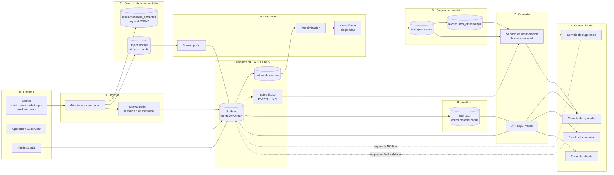

### 1. Descripción del caso de uso
* **Problema a resolver:** una empresa recibe consultas de sus clientes por múltiples canales (chat web, correo electrónico, WhatsApp, teléfono y formulario web) y hoy los atiende de manera dispersa: cada canal deja su propio registro, no existe un identificador único de caso que atraviese la interacción completa y el conocimiento generado al resolver una consulta se pierde una vez finalizada la atención.

Esto presenta las siguientes limitaciones:

1. No hay reutilización del conocimiento: consultas equivalentes se responden desde cero una y otra vez, porque el histórico no es consultable por contenido sino, en el mejor de los casos, por fecha o por cliente.
2. No hay medición confiable de la calidad del servicio: Sin un registro estructurado de los cambios de estado de cada caso, no es posible calcular tiempos de resolución, volumen por canal, carga por operador ni satisfacción del cliente.
3. No hay trazabilidad: no queda registrado quién intervino en cada momento de la atención.

La empresa desea incorporar asistencia basada en IA para **sugerir respuestas a partir de casos históricos ya resueltos**, **identificar las consultas más frecuentes** y **derivar a un operador humano los casos complejos**, conservando en todo momento el histórico de interacciones para mejorar la atención futura y auditar la calidad del servicio.

* **Usuarios principales:** 

| Usuario | Qué hace en el sistema | Qué necesita del modelo de datos |
|---|---|---|
| **Cliente** | Inicia una consulta por alguno de los canales habilitados, recibe una respuesta y califica la atención al cierre | Identidad validada (DNI, email o teléfono), acceso al historial de sus propios casos únicamente |
| **Operador** | Atiende los tickets asignados, revisa las respuestas sugeridas por la IA, las corrige o redacta las propias, cambia el estado del caso | Ver la conversación completa de sus casos, las sugerencias disponibles y su cola de trabajo |
| **Supervisor** | Controla la calidad de la atención, redistribuye carga entre operadores y audita casos puntuales | Indicadores agregados (tiempos de resolución, satisfacción por operador y por canal, tickets pendientes) y acceso de lectura al detalle de cualquier caso del equipo |
| **Administrador** | Gestiona altas y bajas de empleados, roles, canales habilitados y parámetros del sistema | Acceso a las tablas maestras y al esquema |
| **Sistema de IA** | Lee casos históricos resueltos para sugerir respuestas y detectar consultas frecuentes; escribe respuestas sugeridas | Un subconjunto de datos acotado, **sólo de casos ya resueltos y validados**, con el texto anonimizado y con las mismas restricciones de acceso que aplican al usuario que dispara la consulta |

La distinción del sistema de IA como un usuario más (con sus propios permisos de lectura y escritura) es deliberada ya que si el modelo puede recuperar por similitud semántica un caso al que el operador no tendría acceso por la vía relacional habitual, el control de accesos queda vulnerado por una puerta lateral. 

* **Procesos y funcionalidades:** la solución de datos debe soportar los siguientes procesos:

1. **Identificación del cliente.** El cliente se autentica en la plataforma web o se identifica aportando datos privados (DNI, email o teléfono) al contactar por otro canal. Sus datos están validados al momento de generar el caso.
2. **Apertura de un ticket.** Todo contacto genera un ticket asociado obligatoriamente a un cliente, a un canal de origen tomado de un dominio predefinido y a un empleado responsable.
3. **Registro de la conversación.** Cada ticket agrupa una o más conversaciones, y cada conversación contiene una o más consultas concretas del cliente. Esta separación permite que un mismo caso incluya varias preguntas ("¿qué medios de pago aceptan?" y, a continuación, "¿puedo pagar en cuotas?") sin abrir un ticket nuevo por cada una.
4. **Generación de respuestas.** Una consulta puede acumular varias respuestas: la sugerencia automática de la IA, la corrección del operador y la versión efectivamente enviada al cliente. El modelo debe distinguir el **origen** de cada respuesta (automática o humana) y marcar **cuál fue la que resolvió** la consulta, con la regla de que sólo puede existir una respuesta final por consulta.
5. **Derivación y cambio de estado.** El caso atraviesa un flujo de estados (abierto → en proceso → resuelto → cerrado, con posibilidad de reapertura) y puede pasar de un operador a otro. Cada transición queda registrada con fecha y empleado responsable, de modo que el historial sea reconstruible y no sobrescribible.
6. **Cierre y evaluación de satisfacción.** Al finalizar, el cliente puede calificar la atención en una escala acotada. La calificación es opcional.
7. **Cálculo de indicadores de servicio.** A partir del historial de estados y de las calificaciones, el sistema debe permitir calcular tiempos de resolución por canal, carga pendiente por operador, distribución de casos por canal y estado, y proporción de respuestas resueltas automáticamente frente a las resueltas por una persona.
8. **Identificación de consultas frecuentes y sugerencia de respuestas.** Sobre el corpus de consultas ya resueltas y sus respuestas validadas, el sistema debe permitir búsquedas por similitud semántica para agrupar temas recurrentes y proponer respuestas a casos nuevos.
9. **Control de accesos por rol y preservación del historial.** Cada rol accede únicamente al subconjunto de datos que le corresponde, y ninguna baja de cliente, empleado o ticket puede destruir el historial de auditoría asociado.

### 2. Relevamiento de datos necesarios
* **Información requerida:** el relevamiento se organizó por entidad del dominio. 

| Entidad | Datos a almacenar | Por qué se necesita |
|---|---|---|
| **Cliente** | Nombre, apellido, DNI, email, teléfono principal y alternativo, dirección, estado de actividad | Identificar y validar al cliente al abrir un caso y contactarlo por el canal correspondiente. El DNI y el email son identificadores únicos del cliente en el sistema |
| **Empleado** | Nombre, apellido, DNI, departamento, rol asignado, estado de actividad | Asignar responsables a los casos, trazar quién intervino en cada cambio de estado y calcular indicadores por operador |
| **Rol** | Descripción del rol (operador, supervisor, administrador) | Definir el nivel de acceso y las funciones habilitadas para cada empleado. (Se modela como entidad propia para poder incorporar roles nuevos sin modificar el esquema) |
| **Ticket** | Cliente asociado, empleado responsable actual, canal de origen, estado de actividad | Es la unidad de caso que atraviesa todos los canales y da un identificador único a la atención completa |
| **Historial de estados (ticket log)** | Ticket, empleado que ejecuta el cambio, fecha y hora, estado alcanzado | Reconstruir el ciclo de vida del caso, auditar derivaciones entre operadores y calcular tiempos de resolución |
| **Conversación** | Ticket al que pertenece, fecha de inicio, calificación de satisfacción | Agrupar el intercambio dentro de un caso y capturar la evaluación del cliente al cierre |
| **Consulta** | Conversación a la que pertenece, texto de la pregunta del cliente | Es el texto en lenguaje natural que dispara la atención y la unidad mínima sobre la que la IA busca casos similares |
| **Respuesta** | Consulta a la que responde, texto de la respuesta, indicador de origen (humano o automático), indicador de respuesta final | Distinguir sugerencia de IA, corrección humana y respuesta efectivamente enviada |
| **Índice semántico** | Texto de la pregunta y de la respuesta final, canal de origen, vector de embedding, modelo utilizado, fecha de indexación, referencia a la consulta y respuesta de origen | Habilitar la búsqueda por similitud sin recalcular el embedding en cada consulta y sin bloquear las tablas operativas. Es un dato derivado, reconstruible a partir del núcleo transaccional |

* **Riesgos asociados:** 
| # | Riesgo | Descripción | Mitigación prevista en el diseño |
|---|---|---|---|
| R1 | **Exposición de datos personales** | El modelo almacena DNI, email, teléfono y dirección de personas físicas. Una consulta mal filtrada expone información sensible | Control de accesos por rol nativo del motor y *Row Level Security*, de modo que el filtro no dependa de que la aplicación lo recuerde aplicar |
| R2 | **Fuga de datos sensibles por vía semántica** | El cliente puede pegar su DNI, su email o datos de su tarjeta dentro del texto libre de la consulta. Ese texto se vectoriza e indexa, y luego puede reaparecer como "respuesta sugerida" ante un caso de otro cliente | Anonimizar/enmascarar el texto antes de generar el embedding |
| R3 | **Sugerencia de información incorrecta o desactualizada** | Si una respuesta final se corrige después de haber sido indexada, el índice semántico sigue sugiriendo la versión anterior. El sistema propaga entonces una respuesta que la empresa ya invalidó | Reindexación asíncrona ante cualquier modificación del texto de una respuesta final; indexar únicamente respuestas marcadas como finales de casos ya resueltos, nunca sugerencias intermedias o descartadas |
| R4 | **Contaminación del corpus de conocimiento** | La respuesta marcada como final es la que alimenta las sugerencias futuras | Restricción de unicidad de respuesta final por consulta, marca explícita de origen humano o automático y trazabilidad hacia el empleado responsable, para poder auditar |
| R5 | **Pérdida de trazabilidad por borrado físico** | Eliminar un cliente, un empleado o un ticket destruiría el historial de auditoría asociado y falsearía retroactivamente los indicadores de servicio | Borrado lógico mediante el campo `activo` y políticas `ON DELETE RESTRICT` en todas las claves foráneas: ninguna baja puede arrastrar historial |
| R6 | **Inconsistencia de dominio en campos categóricos** | Canales y estados cargados como texto libre derivan en valores equivalentes escritos de distinta forma ("WhatsApp", "whatsapp", "wsp"), que rompen silenciosamente toda agregación por canal o por estado | Dominios cerrados verificados por restricciones `CHECK` a nivel de motor |
| R7 | **Transferencia de datos a un proveedor externo de embeddings** | El texto de las consultas sale de la infraestructura de la empresa | Anonimización previa y, como alternativa evaluable, uso de un modelo de embeddings autoalojado si el volumen o la sensibilidad lo justifican |
| R8 | **Sesgo en los indicadores de desempeño** | Los indicadores por operador (satisfacción promedio, carga pendiente) pueden usarse para evaluar personas sin considerar la complejidad diferencial de los casos ni el volumen de calificaciones recibidas | Exponer siempre el indicador junto a su denominador (cantidad de conversaciones calificadas) y documentar que se trata de una señal de proceso, no de una calificación individual concluyente |

### 3. Clasificación de los datos según su tipo
Clasificación detallada de los datos del dominio según las siguientes categorías:
* **Estructurados:** [Ej. tablas relacionales].
* **Semiestructurados:** [Ej. documentos JSON, configuraciones].
* **No estructurados:** [Ej. texto libre, archivos, imágenes].
* **Operacionales:** [Datos del día a día de la aplicación].
* **Analíticos:** [Datos orientados al análisis y soporte de IA].
* **Sensibles:** [Datos que requieren protección especial].
* **De auditoría o trazabilidad:** [Logs y registros de eventos].

### 4. Modelo conceptual
* **Diagrama conceptual:** [Insertar o hacer referencia al diagrama conceptual (DER/UML)].
* **Descripción del dominio:** Justificación de las entidades principales, sus atributos relevantes, relaciones, cardinalidades y restricciones de negocio identificadas.

### 5. Modelo de implementación según la tecnología elegida
* **Detalle del modelo:** [Presentar el modelo correspondiente a la tecnología seleccionada (Tablas relacionales, Colecciones documentales, Familias de columnas, Nodos/Relaciones de Grafos, o Colecciones Vectoriales)].
* **Estructuras específicas:** Definición de claves primarias, foráneas, tipos de campos, restricciones de integridad e índices según aplique.

### 6. Decisiones de normalización, embebido, referencia o desnormalización

#### 6.1 Estrategia general

El núcleo transaccional de la solución (`clientes`, `empleados`, `roles`, `tickets`, `ticket_logs`, `conversaciones`, `consultas`, `respuestas`) se diseñó como un modelo **relacional normalizado hasta 3FN** en PostgreSQL. Sobre ese núcleo se propone una extensión híbrida con **pgvector** para indexar semánticamente las consultas históricas y sus respuestas finales, con el objetivo de identificar consultas frecuentes y sugerir respuestas (detalle en `vectorial/modelo_vectorial.md`). Esta combinación permite aplicar, dentro del mismo motor de base de datos, los dos enfoques que pide la consigna: normalización clásica para el registro operativo del caso, y decisiones de embebido/referencia/desnormalización propias del mundo NoSQL para el componente de recuperación semántica.

#### 6.2 Normalización del núcleo relacional

El detalle tabla por tabla está documentado en `db/logico/restricciones.md`. Que en resumen se detalla:

- **1FN — valores atómicos, sin grupos repetidos.** Se cumple en las 8 tablas: no existen columnas que almacenen listas (`clientes` separa `telefono_1` y `telefono_2` en vez de un campo concatenado), y toda fila se identifica por una PK simple autonumérica.
- **2FN — dependencia funcional completa de la clave.** Se cumple trivialmente porque ninguna tabla usa clave primaria compuesta: no hay relaciones muchos-a-muchos en el dominio (cada `ticket` tiene un único `cliente` y, en un momento dado, un único `empleado` asignado; cada `respuesta` pertenece a una única `consulta`), por lo que no existen tablas intermedias con dependencias parciales que resolver.
- **3FN — sin dependencias transitivas.** Se revisó cada tabla buscando atributos no clave que dependieran de otro atributo no clave. El caso límite analizado fue `empleados.departamento`: se descartó como dependencia transitiva de `id_rol` porque un mismo rol puede existir en más de un departamento, por lo que `departamento` es un atributo propio del empleado y no un dato derivable del rol.

**Problemas que esta normalización evita, con ejemplos concretos del dominio:**

| Problema | Qué pasaría sin normalizar | Cómo lo evita el diseño |
|---|---|---|
| Redundancia | Repetir `nombre`/`apellido` del empleado en cada fila de `ticket_logs` (una por cada cambio de estado de cada ticket) | `ticket_logs.id_empleado` referencia a `empleados`; el nombre se guarda una sola vez |
| Anomalía de inserción | No poder dar de alta un `rol` nuevo hasta que exista un empleado con ese rol, si el rol viviera como texto suelto dentro de `empleados` | `roles` es una entidad propia; se puede crear un rol sin empleados asignados todavía |
| Anomalía de actualización | Si la descripción de un rol se repitiera en cada empleado, cambiar el nombre de un rol obligaría a actualizar N filas, con riesgo de dejar alguna desactualizada | `empleados.id_rol` es FK a `roles`; la descripción se actualiza en un único lugar |
| Anomalía de eliminación | Si `consultas`/`respuestas` fueran columnas embebidas en `tickets`, cerrar o depurar un ticket podría arrastrar la pérdida de toda la conversación | Cada entidad tiene su propio ciclo de vida y PK; además se usa *soft delete* (`activo = false`) en vez de `DELETE` físico |
| Inconsistencia de dominio | `canal_origen` como texto libre permitiría valores como "WhatsApp"/"whatsapp"/"wsp" | `CHECK (canal_origen IN (...))` fija un dominio cerrado de valores válidos |

#### 6.3 Desnormalización controlada

Se identificaron dos desnormalizaciones **intencionales**, documentadas y justificadas por patrón de consulta, no por descuido de diseño:

**a) `tickets.id_empleado` (asignación actual) frente al histórico de `ticket_logs`.** El empleado asignado actualmente a un ticket se refleja tanto en `tickets.id_empleado` como, implícitamente, en la última fila de `ticket_logs` de ese ticket.
- *Ventaja:* la consulta más frecuente del sistema —"¿qué tickets tiene asignados cada operador ahora mismo?"— se resuelve con un filtro directo sobre `tickets`, sin calcular por cada ticket cuál es su log más reciente.
- *Compromiso:* ambos valores deben mantenerse sincronizados (toda reasignación debe escribirse en ambas tablas, idealmente en la misma transacción). Se acepta este costo de escritura porque un ticket se reasigna pocas veces pero se consulta su estado actual constantemente.

**b) Índice vectorial de consultas/respuestas frecuentes (extensión pgvector).** Para identificar consultas frecuentes y sugerir respuestas, se decidió mantener una tabla desnormalizada de solo lectura (`consultas_embeddings`) que **referencia** la fila de origen (`id_consulta`/`id_respuesta`, para trazabilidad) pero **duplica (embebe)** una copia normalizada del texto de la pregunta y de la respuesta final junto a su vector, en lugar de resolver esto con un `JOIN` en caliente contra `consultas`/`respuestas`.
- *Ventaja:* las búsquedas de similitud —potencialmente muy frecuentes si se ejecutan por cada consulta entrante— no compiten por bloqueos ni I/O con las tablas operativas, y se benefician de un índice `HNSW` dedicado.
- *Compromiso:* si el texto original se corrige después de indexado, el contenido embebido queda desactualizado hasta la próxima reindexación (proceso batch o disparado por evento). Se acepta **consistencia eventual** en este componente puntual, mientras el núcleo transaccional (estado del ticket, quién respondió, calificación) mantiene consistencia fuerte en todo momento. Esta es la misma lógica de "desnormalización controlada" propia de NoSQL, aplicada dentro del motor relacional gracias a pgvector.

#### 6.4 Cómo la estructura responde a los patrones de consulta esperados

- *Selección y filtrado operativo* (tickets abiertos de un cliente, por canal o por operador) → índices sobre `tickets.id_cliente`, `tickets.id_empleado`, `tickets.canal_origen`.
- *Reconstrucción de una conversación completa* → cadena de JOINs `clientes → tickets → conversaciones → consultas → respuestas`, con integridad referencial garantizada.
- *Indicadores de calidad de servicio* (tiempos de resolución, satisfacción promedio por canal/operador) → agregaciones (`GROUP BY`, `AVG`) sobre `ticket_logs.fecha` y `conversaciones.calificacion`.
- *Auditoría de respuestas automáticas vs. humanas* → `respuestas.es_humano` y `respuestas.es_respuesta_final`, con la regla de unicidad de respuesta final por consulta.
- *Identificación de consultas frecuentes / sugerencia de respuestas* → `ORDER BY embedding <-> query_vector LIMIT N` sobre `consultas_embeddings`, combinable con filtros SQL convencionales en la misma sentencia.

### 7. Justificación de la tecnología seleccionada

#### 7.1 Tecnología elegida

**PostgreSQL** como motor único, con la **extensión `pgvector`** habilitada sobre el mismo motor para el componente de búsqueda semántica. No se incorpora ningún motor NoSQL adicional (documental, clave-valor, columnar o de grafos) como parte del sistema de registro.

#### 7.2 Justificación según los criterios de la consigna

- **Tipo de datos a almacenar.** El dominio combina datos estructurados con reglas de negocio estrictas (clientes, empleados, tickets, estados) con una porción de texto libre en lenguaje natural (`consultas.pregunta`, `respuestas.texto_respuesta`). Esta última porción es la única candidata a tratamiento vectorial (ver punto 11); el resto del dominio es naturalmente tabular.

- **Estructura y variabilidad de los datos.** El esquema es estable, los canales de atención, los estados de ticket y los roles son un conjunto cerrado y conocido de antemano (reforzado con `CHECK`), no datos que cambien de forma en cada registro. Esto favorece un esquema fijo y tipado por sobre un esquema flexible tipo documento.

- **Volumen esperado.** Es un sistema de atención al cliente pensado para empresas con un volumen de consultas bajo a mediano, no una plataforma de escala masiva (redes sociales, IoT). El volumen de tickets/consultas/respuestas es alto pero manejable por PostgreSQL.

- **Patrones de consulta.** Conviven tres patrones: transaccional (OLTP) sobre un ticket puntual, analítico/agregado para reportes de calidad de servicio (JOINs, `GROUP BY`, funciones de ventana), y búsqueda por similitud para sugerencia de respuestas. PostgreSQL + pgvector resuelve los tres dentro de un mismo motor y una misma transacción, evitando construir y sincronizar sistemas separados.

- **Relaciones entre entidades.** Son numerosas, jerárquicas y bien definidas (`cliente → ticket → conversación → consulta → respuesta`, `empleado → rol`), con reglas de integridad estrictas (una respuesta no puede existir sin una consulta; una consulta sólo puede tener una respuesta marcada como final). Este tipo de reglas se expresa de forma nativa con `FOREIGN KEY`, `CHECK` y transacciones; en un modelo documental habría que reimplementarlas a nivel aplicación, con mayor riesgo de inconsistencia.

- **Consistencia requerida.** El estado de un ticket, quién lo atendió y la calificación de satisfacción alimentan reportes de gestión: requieren consistencia fuerte y transacciones ACID. El único componente donde se acepta consistencia eventual es el índice vectorial de sugerencias, que no es fuente de verdad sino una ayuda de recuperación.

- **Seguridad y control de acceso.** El caso exige aislar lo que puede ver cada rol (cliente, operador, supervisor, administrador). PostgreSQL permite resolver esto con **roles nativos + Row Level Security (RLS)**, aplicando el control a nivel de motor en lugar de depender exclusivamente de que la aplicación recuerde aplicar el filtro correcto.

- **Necesidades de escalabilidad.** Moderadas en el estado actual, con margen de crecimiento vía escalabilidad vertical inmediata y, si es necesario, horizontal (réplicas de lectura, particionamiento). No se justifica, a esta escala, la complejidad de un sistema distribuido tipo Cassandra.

- **Complejidad operativa.** Un único motor para lo transaccional, lo analítico básico y lo vectorial reduce la cantidad de piezas de infraestructura a desplegar, respaldar, monitorear y asegurar, frente a combinar PostgreSQL + MongoDB + una base vectorial dedicada. Se optó por la combinación mínima que cubre los requerimientos reales del caso.

**Ventajas y limitaciones frente a otras alternativas:**

| Alternativa | Por qué no se adoptó como base para este caso |
|---|---|
| MongoDB (documental) | El dominio tiene relaciones estables y reglas de integridad estrictas. Modelarlo como documentos obligaría a duplicar datos de cliente/empleado en cada documento relacionado, reproduciendo los problemas de redundancia y actualización que la normalización busca evitar. |
| Cassandra (columnar) | Pensada para volúmenes de escritura muy altos con consultas conocidas de antemano por clave de partición (streams de eventos/sensores). Este caso no tiene ese perfil de escritura y prioriza consistencia fuerte sobre disponibilidad extrema, lo opuesto al compromiso CAP típico de Cassandra. |
| Neo4j (grafos) | Las relaciones del dominio tienen profundidad conocida y acotada (pocos saltos de FK), no recorridos de longitud variable ni preguntas tipo "camino más corto". Un grafo agregaría complejidad de modelado sin resolver mejor los patrones de acceso reales. |
| Redis (clave-valor) | Útil como complemento futuro (caché de respuestas frecuentes, estado temporal de una conversación en curso, *rate limiting*) pero no como sistema de registro: no ofrece integridad referencial ni consultas relacionales. Se deja como posible mejora de escalabilidad, no como parte del núcleo. |
| Base vectorial dedicada (Pinecone, Weaviate, Milvus, etc.) | Sumaría un segundo sistema a operar, sincronizar y asegurar por separado, con riesgo de que los metadatos de permisos queden desacoplados de la base transaccional. Con el volumen esperado, `pgvector` dentro de PostgreSQL cubre la necesidad sin ese costo operativo y sin duplicar el modelo de permisos. |
| **PostgreSQL + pgvector (adoptada)** | Cubre en un solo motor, integridad referencial y transacciones ACID para el núcleo operativo, consultas analíticas complejas para reportes de calidad de servicio, y búsqueda por similitud para consultas frecuentes/respuestas sugeridas — con un único modelo de seguridad (roles + RLS) aplicado de forma consistente a todos los datos, incluidos los vectores. |

#### 7.3 Límites reconocidos de la elección

Se reconoce que, si el volumen de búsquedas semánticas creciera órdenes de magnitud (por ejemplo, si la solución se ofreciera como plataforma multi-tenant a muchas empresas), podría justificarse migrar el componente vectorial a un motor dedicado. A la escala del caso propuesto (una empresa gestionando su propia atención al cliente), esa complejidad adicional no se justifica hoy.

### 8. Implementación mínima realizada

#### 8.1 Alcance de la implementación

La implementación mínima se realizó en **PostgreSQL 16** sobre una base de datos denominada `bdia`. Se construyó el núcleo relacional completo definido en el modelo lógico, compuesto por las tablas `roles`, `clientes`, `empleados`, `tickets`, `ticket_logs`, `conversaciones`, `consultas` y `respuestas`.

La estructura física incluye:

- Identificadores autonuméricos mediante columnas `IDENTITY`;
- Claves primarias y foráneas para garantizar la integridad referencial;
- Restricciones `NOT NULL`, `UNIQUE` y `CHECK` para controlar los dominios;
- Políticas `ON DELETE RESTRICT` y `ON UPDATE CASCADE` en las relaciones;
- Borrado lógico mediante el campo `activo` en clientes, empleados y tickets;
- Nueve índices para claves foráneas y patrones de consulta frecuentes;
- Un índice único parcial que garantiza una sola respuesta final por consulta;
- Una vista que presenta el cliente, empleado asignado y último estado de cada ticket.

La extensión `pgvector` y la tabla `consultas_embeddings` se mantienen como propuesta del componente vectorial descripto en el punto 11; no forman parte del núcleo transaccional mínimo implementado en esta etapa.

#### 8.2 Scripts desarrollados

Los archivos deben ejecutarse respetando el siguiente orden:

1. `db/fisico/01_creacion_tablas.sql`: Crea las ocho tablas, sus tipos de datos, claves y restricciones de integridad.
2. `db/fisico/02_indices_vistas.sql`: Crea los índices de rendimiento, la restricción de respuesta final única y la vista `vw_estado_actual_tickets`.
3. `data/03_datos_ejemplo.sql`: Carga el conjunto sintético utilizado para comprobar las relaciones y consultas.
4. `db/fisico/04_validaciones.sql`: Ejecuta trece pruebas automáticas sobre las estructuras creadas.

Todos los scripts utilizan transacciones. Los tres primeros finalizan con `COMMIT` para evitar una implementación parcialmente cargada ante un error. El script de validaciones finaliza con `ROLLBACK`, ya que realiza inserciones y actualizaciones intencionalmente inválidas para comprobar las restricciones sin alterar los datos de ejemplo.

### 9. Datos de ejemplo utilizados

#### 9.1 Estructura de prueba

Se generó un conjunto de datos completamente **sintético**, sin información personal real, con el siguiente volumen:

| Tabla | Registros | Casos representados |
|---|---:|---|
| `roles` | 3 | Operador, supervisor y administrador |
| `empleados` | 5 | Operadores de distintas áreas, un supervisor y un administrador |
| `clientes` | 6 | Clientes con datos de contacto obligatorios y opcionales |
| `tickets` | 10 | Todos los canales admitidos y un caso de borrado lógico |
| `ticket_logs` | 31 | Estados abiertos, en proceso, resueltos, cerrados y reabiertos |
| `conversaciones` | 10 | Casos con y sin calificación de satisfacción |
| `consultas` | 12 | Conversaciones con una o varias preguntas |
| `respuestas` | 17 | Respuestas de IA, humanas, intermedias y finales |

Los datos permiten representar tickets en distintas etapas del ciclo de vida, derivaciones entre operadores, diferentes canales de atención, conversaciones pendientes y finalizadas, calificaciones entre 1 y 5 y consultas con múltiples respuestas. Los identificadores se establecieron explícitamente para facilitar la lectura de las relaciones y, al finalizar la carga, se sincronizaron las secuencias autonuméricas para permitir nuevas inserciones.

#### 9.2 Validación de coherencia

El archivo `db/fisico/04_validaciones.sql` comprueba automáticamente:

- La existencia de las ocho tablas y las cantidades esperadas de datos;
- La unicidad del DNI de los clientes;
- La obligatoriedad del correo electrónico;
- El rechazo de claves foráneas inexistentes;
- Los dominios cerrados de canales y calificaciones;
- El rechazo de consultas vacías;
- La regla de una sola respuesta final por consulta;
- La aplicación de valores predeterminados;
- La conservación del historial mediante borrado lógico;
- El cálculo correcto del último estado a través de la vista;
- La existencia del índice único parcial y de la vista implementada.

Cada prueba informa un mensaje `OK` cuando PostgreSQL rechaza o procesa el caso de la forma esperada. Como el script completo finaliza con `ROLLBACK`, los registros temporales utilizados en las pruebas no permanecen almacenados.

### 10. Consultas representativas
Breve explicación de la utilidad de cada una de las 5 consultas mínimas requeridas, adjuntando el código correspondiente:
1. **Consulta 1 (Selección y filtrado):** ¿Qué tickets tiene pendiente cierto operador? Muestra los trabajos que todavía tiene por terminar el operador.

```sql
SELECT id_ticket, cliente, canal_origen, estado_actual, fecha_ultimo_estado 
FROM vw_estado_actual_tickets 
WHERE id_empleado = 3 AND activo = TRUE AND estado_actual IN ('abierto', 'en_proceso', 'reabierto') 
ORDER BY fecha_ultimo_estado;
```


2. **Consulta 2 (Información relacionada / JOINs):** Esta consulta responde a la pregunta: ¿Qué consultas realizó un cliente y qué respuestas fueron generadas por IA o enviadas por una persona?

```sql
SELECT t.id_ticket, CONCAT_WS(' ', c.nombre, c.apellido) AS cliente, conv.id_conversacion, q.id_consulta, q.pregunta, resp.id_respuesta, resp.texto_respuesta,
       CASE
           WHEN resp.es_humano = TRUE THEN 'Humana' 
           ELSE 'IA'
       END AS origen_respuesta, resp.es_respuesta_final 
FROM tickets AS t 
INNER JOIN clientes AS c ON c.id_cliente = t.id_cliente 
INNER JOIN conversaciones AS conv ON conv.id_ticket = t.id_ticket
INNER JOIN consultas AS q ON q.id_conversacion = conv.id_conversacion 
LEFT JOIN respuestas AS resp ON resp.id_consulta = q.id_consulta 
WHERE t.id_ticket = 9 
ORDER BY q.id_consulta, resp.id_respuesta;
```

3. **Consulta 3 (Agregaciones / Indicadores):** Esta consulta responde el porcentaje de respuestas finales de IA y humanas.

```sql
SELECT 
    CASE 
        WHEN es_humano = TRUE THEN 'Humana' 
        ELSE 'IA' END AS origen_respuesta, 
        COUNT(*) AS cantidad_respuestas_finales, 
        ROUND( 100.0 * COUNT(*) / SUM(COUNT(*)) OVER (), 2 ) AS porcentaje 
FROM respuestas 
WHERE es_respuesta_final = TRUE
GROUP BY es_humano 
ORDER BY cantidad_respuestas_finales DESC;
```

4. **Consulta 4 (Toma de decisiones):** Esta consulta responde la carga de trabajo pendiente por cada operador. Para que el supervisor pueda ver cuanto
trabajo tiene cada operador y asignar tareas en base a ello.

```sql
SELECT 
    e.id_empleado, 
    CONCAT_WS(' ', e.nombre, e.apellido) AS operador, 
    COUNT(actual.id_ticket) AS tickets_pendientes 
FROM empleados AS e 
INNER JOIN roles AS r ON r.id_rol = e.id_rol 
LEFT JOIN vw_estado_actual_tickets AS actual ON actual.id_empleado = e.id_empleado AND actual.activo = TRUE AND actual.estado_actual IN ('abierto', 'en_proceso', 'reabierto') 
WHERE r.descripcion = 'Operador' AND e.activo = TRUE 
GROUP BY e.id_empleado, e.nombre, e.apellido 
ORDER BY tickets_pendientes DESC, operador;
```

5. **Consulta 5 (Optimización mediante Índices/Vistas):** La vista vw_estado_actual_tickets evita repetir en cada consulta los JOIN necesarios para relacionar tickets, clientes, empleados, roles y el último registro de ticket_logs. Esto simplifica las consultas operativas y centraliza la lógica utilizada para determinar el estado actual de cada ticket. Además, la búsqueda del último registro se optimiza mediante el índice compuesto idx_ticket_logs_ticket_fecha, que busca por ticket y el orden descendiente de la fecha.

```sql
SELECT canal_origen, estado_actual, COUNT(*) AS cantidad_tickets 
FROM vw_estado_actual_tickets 
WHERE activo = TRUE 
GROUP BY canal_origen, estado_actual
ORDER BY canal_origen, cantidad_tickets DESC;
```

### 11. Propuesta para datos semiestructurados, no estructurados o vectoriales

> El desarrollo completo de este punto está en `docs/09_datos_semiestructurados_no_estructurados_vectorial.md` (inventario dato por dato, comparación de alternativas de almacenamiento, metadatos del índice semántico, filtros por permisos y análisis de riesgos). Lo que sigue es la síntesis.

#### 11.1 Inventario real del esquema implementado

De las 8 tablas y aproximadamente 40 columnas del modelo físico:

- **Estructurado:** todo el núcleo, con dominios cerrados por `CHECK` (`canal_origen`, `estado`, `calificacion`) e integridad por `FOREIGN KEY`.
- **Semiestructurado:** **ninguno**. No existe una sola columna `JSON`/`JSONB`, `ARRAY`, `hstore` ni XML en `01_creacion_tablas.sql`.
- **No estructurado:** exactamente **dos columnas**, `consultas.pregunta` y `respuestas.texto_respuesta`, ambas `TEXT` con `CHECK LENGTH > 0`.
- **De auditoría:** `ticket_logs` es un log de eventos de negocio, pero **de esquema fijo y dominio cerrado**: no es un log semiestructurado y no corresponde sacarlo del modelo relacional.
- **Relaciones:** jerarquía lineal de profundidad fija (`cliente → ticket → conversación → consulta → respuesta`); **ninguna relación muchos-a-muchos en las 8 tablas**. No hay estructura "altamente conectada" que justifique un grafo, en línea con lo argumentado en 7.2.

#### 11.2 Manejo de datos complejos: JSON/JSONB sí, pero acotado a tres lugares

JSONB se justifica **solo donde la variabilidad de esquema es real**, no como estrategia general. Tres candidatos concretos, hoy inexistentes:

| Dato | Representación | Motivo |
|---|---|---|
| Metadatos técnicos por canal (`message_id` de email, `wa_id`, duración de llamada, sesión de chat web) | `tickets.metadatos_canal JSONB` | Los atributos **cambian según el valor de `canal_origen`**; columnas nullables por canal o un esquema EAV son peores y obligan a migrar el esquema al habilitar un canal nuevo |
| Trazas de generación de una sugerencia de IA (modelo, tokens, confianza, casos recuperados como contexto) | `respuestas.metadatos_generacion JSONB` | Cambia con cada versión del modelo; hace **auditable** la sugerencia (mitiga R4) sin un `ALTER TABLE` por proveedor. Hoy `es_humano` dice *que* fue automática, no *cómo* |
| Parámetros del sistema (umbral de similitud, cantidad de sugerencias, canales habilitados) | `parametros(clave TEXT PK, valor JSONB)` | Claves heterogéneas y volumen mínimo. La sección 1 atribuye "parámetros del sistema" al Administrador y **no existe tabla que lo soporte** |

**Regla adoptada:** ningún dato que alimente un indicador de gestión, una FK o una restricción de negocio vive dentro de un JSONB. El JSONB documenta lo accesorio; el esquema tipado garantiza lo que se mide. Por contraste, el motivo de una derivación —que el enunciado pide y hoy queda implícito en `ticket_logs` (ticket 5: logs 14 y 15, mismo estado, distinto empleado)— **no** debe ir a JSONB: su estructura es estable y necesita FK a `empleados`, así que corresponden columnas nuevas (`id_empleado_anterior`, `motivo`).

**No se incorpora ninguna colección NoSQL**, confirmando 7.2. Los binarios que el caso implica pero el modelo no tiene (adjuntos de email, foto de producto dañado, audio del canal `telefono` — hoy el ticket 5 presupone una transcripción no modelada) corresponden a **almacenamiento de objetos externo + tabla de metadatos**, no a `BYTEA` ni a un motor documental.

#### 11.3 Enfoque vectorial: se justifica, acotado a 2 columnas

**Qué se vectorizaría:** únicamente el par `consultas.pregunta` + su `respuestas.texto_respuesta` final, en casos **cerrados y vigentes** — 10 pares en el conjunto de ejemplo.

**Por qué la búsqueda tradicional no alcanza:** es un límite de expresividad, no de rendimiento. El FTS nativo (`tsvector` + GIN, config `spanish`, con `unaccent`) es exacto, barato y **debería implementarse igual, antes que los vectores**; pero no resuelve **sinonimia ni paráfrasis**, que es el problema real (*"clave"* y *"contraseña"* no comparten lexema). La prueba está en los datos del proyecto: la consulta 1 (*"Como puedo restablecer mi contrasena?"*) y la consulta 11 (*"No puedo ingresar a la aplicacion movil"*, respondida con *"actualizar la aplicacion y restablecer la contraseña"*) son el mismo problema y **no comparten una sola palabra de contenido**.

**Metadatos que deben acompañar al vector.** El diseño de `vectorial/modelo_vectorial.md` se suscribe en su estructura general, con nueve correcciones. Las tres decisivas:

1. **Faltan `id_cliente` e `id_ticket`.** Sin ellos, la RLS que ese documento declara **no es implementable** sin el JOIN a `consultas → conversaciones → tickets` que la desnormalización existía para evitar.
2. **Falta `es_humano` de la respuesta final.** En los datos de ejemplo **3 de las 10 respuestas finales son puramente de IA** (`id_respuesta` 3, 12, 17): indexarlas sin marca hace que el sistema se alimente de su propia salida, que es R4 sin mitigación efectiva.
3. **Falta la fecha del caso** — y no es derivable de forma barata, porque **ni `consultas` ni `respuestas` tienen columna de fecha**. La recencia es el filtro más importante: una resolución vieja puede ser hoy incorrecta aunque siga siendo la más parecida.

Las otras seis: agregar `hash_contenido` y `vigente`; agregar `UNIQUE (id_consulta)` (sin él la reindexación duplica filas e infla los conteos de "consultas frecuentes"); convertir el filtro por canal en re-ranking blando en lugar de `WHERE canal_origen = ...`, que parte el corpus en cinco por una razón irrelevante al contenido; reemplazar el `GROUP BY contenido_pregunta` de la segunda consulta, que **cuenta duplicados literales y no similares**, por clustering o conteo de vecinos por radio; diferir el índice HNSW, que es aproximado y con 10 filas rinde peor que el scan exacto; y exigir **umbral de distancia** en toda consulta, porque sin él la búsqueda siempre devuelve *k* resultados aunque ninguno sirva.

**Corrección del criterio de indexación, con evidencia en los datos de ejemplo.** Indexar por `es_respuesta_final = TRUE` sin mirar el estado del ticket es insuficiente en dos sentidos verificables:

- **`resuelto` no es un estado terminal** en este modelo: existe `reabierto`, y el ticket 8 recorre `abierto → resuelto → reabierto → en_proceso`. Indexar al llegar a `resuelto` cargaría al corpus un caso que después se probó no resuelto.
- **Hay respuestas finales en tickets dados de baja:** el **ticket 7 tiene `activo = FALSE`** (borrado lógico por duplicado) y su consulta 7 **sí tiene respuesta final** (`id_respuesta` 10). Con el criterio actual, ese caso entraría al índice y sería sugerible: el riesgo de "documentos eliminados pero presentes en el índice" ya está materializado en el conjunto de prueba.

**Riesgos y mitigación.** Sobre los ya identificados en la sección 2, los específicos del componente semántico:

- **Desactualización silenciosa.** R3 cubre el caso en que el texto cambia. No cubre el caso en que **el texto no cambia y el mundo sí**: *"Se aceptan tarjetas de credito, debito y transferencia bancaria"* (respuesta 12) sigue idéntica cuando la empresa deja de aceptar transferencias, y **ningún trigger lo detecta porque no hubo `UPDATE`**. Solo lo mitigan la ventana de recencia y la revisión periódica. Riesgo abierto.
- **Falsos positivos plausibles.** Las consultas 9 (*"Que medios de pago aceptan?"*) y 10 (*"Puedo pagar la compra en cuotas?"*) son vecinas muy cercanas con respuestas **no intercambiables**. La negación agrava el problema: *"puedo cancelar"* y *"no puedo cancelar"* son casi idénticos como vectores y opuestos como intención.
- **Autorización.** `roles` tiene 3 filas (Operador, Supervisor, Administrador): **no existe identidad de base de datos para el "Sistema de IA"** que la sección 1 describe como usuario con permisos propios, ni hay un solo `CREATE POLICY` en los scripts. Hoy la IA consultaría con las credenciales de la aplicación, es decir con acceso a todo el corpus — exactamente la "puerta lateral" que la sección 1 advierte.

  **[Actualización, sección 13]:** este riesgo ya está resuelto para el núcleo relacional — `db/fisico/05_seguridad_permisos.sql` define `rol_sistema_ia` (solo puede insertar sugerencias `es_humano = false`, sin lectura amplia propia: la recuperación corre con el rol de quien pregunta, tal como pide este punto) y RLS sobre las 8 tablas núcleo, probado contra Postgres real. Sigue abierto específicamente para `consultas_embeddings`, que no existe físicamente todavía — ver la corrección de columnas (`id_cliente`/`id_ticket`) en la sección 13.
- **Privacidad.** La anonimización debe ocurrir **antes de calcular el embedding**, como ya indica R2, porque el vector conserva información del texto original y existen ataques de inversión. Además queda una tensión abierta: `clientes.activo = FALSE` se documenta como "anonimización de datos personales", pero **nada anonimiza el texto de sus consultas ya indexadas**.
- **Pérdida de contexto.** La consulta 12 (*"Cuanto tiempo dura el enlace para cambiar la contrasena?"*) solo se entiende leída después de la consulta 1 de su misma conversación; indexada suelta es un fragmento huérfano.
- **Volumen.** Con 10 pares indexables el componente es **demostrativo, no útil**: su valor aparece a partir de algunos cientos de casos cerrados.

#### 11.4 Conclusión del punto

**Sí se justifica una solución vectorial, acotada y condicionada.** Se justifica porque el enunciado exige sugerir respuestas a partir de casos históricos y el obstáculo es la sinonimia, que ninguna técnica léxica resuelve sin un glosario mantenido a mano indefinidamente. Se acota a **2 columnas de las ~40 del esquema**: el resto del dominio requiere igualdad, rango o agregación, y para eso el B-tree es exacto, más rápido y auditable. Y se condiciona a tres requisitos sin los cuales hace más daño que bien: anonimización previa al cálculo del embedding; RLS efectiva sobre la tabla de vectores (lo que exige `id_cliente`/`id_ticket` y una identidad de base de datos para la IA); y la sugerencia entregada **al operador como borrador**, nunca automáticamente al cliente.

Esa tercera condición ya está soportada por el modelo relacional y es su mejor decisión de diseño para este punto: la sugerencia de IA vive como respuesta no final y un humano crea la final, patrón visible en las cadenas 1→2, 5→6 y 13→14 de los datos de ejemplo.

No se justifica, en cambio, una base vectorial dedicada (`pgvector` en el mismo motor cubre la necesidad con un único modelo de permisos, según 7.2), ni construir el componente antes que el FTS nativo, que hoy tampoco existe y resuelve el caso más frecuente a un costo mucho menor.

### 12. Propuesta de arquitectura de datos

> El desarrollo completo está en `docs/10_arquitectura_de_datos.md` (capa por capa, ciclo de vida extremo a extremo, consistencia y reconstruibilidad por capa, seguridad, etapas de implementación y umbrales de evolución). Lo que sigue es la síntesis.

#### 12.1 Punto de partida

De las nueve capas que la arquitectura contempla, **hoy existe una**: la operacional (8 tablas, 9 índices, 1 vista). No hay ingesta, ni datos crudos, ni capa de procesamiento, ni almacenamiento analítico como tal —los indicadores se calculan en caliente con las consultas de `db/consultas/`—, ni la tabla de embeddings, ni consumidores (no hay código de aplicación). Por eso el criterio rector es que **cada capa se pueda incorporar por separado y el sistema funcione sin las que faltan**.

> **[Actualización, sección 13]:** el control de acceso (roles de PostgreSQL + RLS sobre las 8 tablas del núcleo) ya no falta — está en `db/fisico/05_seguridad_permisos.sql`, probado contra una instancia real. Este punto se escribió contra el estado de `master` sin esa rama; el resto del análisis de esta sección (capas, ciclo de vida, umbrales) no depende de ese hecho y sigue vigente.

Tres reglas gobiernan el diseño: una sola fuente de verdad (el núcleo relacional; todo lo demás es derivado y reconstruible); ninguna capa derivada es indispensable para atender un caso; y el dato personal se degrada al avanzar (identificable en el crudo, con RLS en el operacional, **anonimizado antes de entrar a la capa de IA**).

#### 12.2 Diagrama de arquitectura



El dato entra por un canal, se guarda crudo para poder reprocesarlo, se normaliza hacia el núcleo transaccional, y de ahí salen tres derivados independientes —índice léxico, corpus anonimizado con sus vectores, y vistas de indicadores— que alimentan a los cuatro consumidores. Las flechas punteadas son el **lazo de retroalimentación**: la respuesta que el operador valida vuelve al núcleo y desde ahí al corpus. Es lo que el enunciado llama "conservar el historial para mejorar la atención futura", y la única parte cíclica del diseño.

#### 12.3 Flujo y componentes

**Fuentes.** Cinco canales de cliente, más operadores, supervisores, administrador y el sistema de IA. Dato arquitectónicamente decisivo: **los cinco canales convergen en un único esquema**. No son cinco sistemas heterogéneos a integrar, son cinco formatos de entrada del mismo hecho — lo que elimina el principal motivo para construir un Data Warehouse.

**Ingesta.** Un adaptador por canal (webhook, IMAP, telefonía) que produce un evento uniforme y es el único componente que conoce las particularidades del canal; resolución de identidad; y escritura transaccional al núcleo. Aquí aparece un hueco del modelo: `tickets.id_cliente` es `NOT NULL`, así que **no se puede abrir un ticket cuyo cliente todavía no se identificó** —lo primero que llega por WhatsApp o teléfono es un número que puede no estar en `clientes`. La salida adoptada es retener el mensaje en la capa cruda hasta poder identificarlo, en lugar de rechazar el contacto o crear clientes provisionales que violarían `UNIQUE NOT NULL` en `dni` y `email`.

**Orquestación:** tabla **outbox** consumida por un worker. El evento se escribe en la misma transacción que el hecho, así que no puede perderse; es reintentable e idempotente vía `hash_contenido`; y **no agrega infraestructura**. Se descarta `LISTEN`/`NOTIFY` porque el aviso no es persistente, y una cola externa (Kafka, RabbitMQ) porque a este volumen es un broker más que operar sin beneficio, en la misma línea con que 7.2 descartó Cassandra.

**Datos crudos.** Payload original en `crudo.mensajes_entrantes` + binarios en almacenamiento de objetos. Se justifica por tres razones concretas: poder **reprocesar la anonimización** cuando el anonimizador mejore (sin el original, cada mejora aplica solo hacia adelante y el corpus viejo queda con fugas permanentes), poder **reprocesar la transcripción** del canal `telefono`, y **auditoría** ante una disputa sobre qué dijo el cliente. No es un Data Lake: es una tabla append-only más un bucket, que nadie consulta analíticamente. Dos decisiones que obliga: **retención acotada** (~90 días) y **el acceso más restringido de todo el sistema**, porque es la única capa con el texto sin anonimizar.

**Almacenamiento operacional.** Las 8 tablas actuales, sin cambio de naturaleza. Absorbe todas las adiciones del punto 11 (`metadatos_canal`, `metadatos_generacion`, `respuestas.fecha`, `comentario`, derivación explícita en `ticket_logs`, `adjuntos`/`transcripciones`, `parametros`, `outbox_eventos`) más el índice FTS, que conviene mantener dentro de esta capa: se calcula desde la misma fila, es transaccionalmente consistente y no requiere anonimizar.

**Datos procesados.** Transcripción → anonimización → curación de elegibilidad. El orden es la clave: **la capa de IA nunca ve el texto identificable**, y eso es una frontera del flujo, no una política que la aplicación deba recordar aplicar.

**Datos preparados para IA.** `ia.corpus_casos` (anonimizado y curado) y `ia.consultas_embeddings` (vector + metadatos corregidos en 11.3), en un esquema propio y desactivable.

**Almacenamiento analítico.** Esquema `analitico` con **vistas materializadas** refrescadas por planificador, no un motor separado. Se materializa porque la consulta de tiempo promedio de resolución agrupa `ticket_logs` completa con dos `FILTER` y un JOIN a una vista que resuelve un `LATERAL` por ticket: su costo crece con el histórico, no con el volumen del día. Y `ticket_logs` es la tabla de mayor crecimiento del modelo (~3 filas por ticket, más una por cada derivación y reapertura). Un supervisor mirando un tablero no necesita el dato al segundo: **aceptar consistencia eventual aquí es gratis**, la misma decisión que 6.3 ya tomó para el índice vectorial. Excepción: "temas más consultados" no se puede materializar con SQL porque requiere agrupar por significado — vive en la capa de IA y es la única dependencia real del tablero respecto del componente vectorial.

**Componentes de consulta.** Vistas y API SQL sobre el operacional (`vw_estado_actual_tickets` ya cumple ese rol); búsqueda léxica FTS; consultas analíticas; y el **servicio de recuperación**, que genera candidatos combinando FTS y ANN, los fusiona, filtra duro por permisos/estado/vigencia/recencia, re-rankea blando por canal/origen/calificación, aplica umbral y —si nada lo supera— **no sugiere y deriva a un humano**. Dos decisiones: la recuperación es **híbrida y no puramente vectorial** (el FTS acierta donde el vocabulario coincide, el vector donde hay sinonimia, y el servicio funciona en modo solo-léxico si la capa vectorial no existe todavía); y el umbral vive en el servicio, no en el consumidor, porque delegarlo garantiza que alguna aplicación termine mostrando el mejor de los malos resultados.

**Consumidores y accesos.** Portal del cliente, consola del operador, panel del supervisor, consola de administración, servicio de sugerencia, worker de procesamiento y planificador analítico — cada uno con su rol de PostgreSQL y su alcance de RLS. El renglón crítico: arquitectónicamente el servicio de IA **debe consultar con la identidad del usuario que originó la consulta**, no con una identidad de servicio con acceso total — si consulta como servicio, la RLS del operacional queda intacta y perfectamente inútil, porque el contenido sale por el costado semántico: es la "puerta lateral" del punto 1 expresada como requisito de arquitectura. **[Actualización, sección 13]:** `rol_sistema_ia` (`db/fisico/05_seguridad_permisos.sql`) ya sigue exactamente este criterio — solo inserta sugerencias, sin lectura propia amplia.

#### 12.4 Consistencia y reconstruibilidad

**Solo dos capas son autoritativas** (crudo y operacional) y **solo una es irremplazable** (operacional): todo lo demás se regenera con un script, así que un respaldo del núcleo más el código de los workers reconstruye el 100% del sistema aguas abajo. La consistencia eventual queda **confinada a lo derivado**: ningún dato que alimente una decisión operativa (estado del ticket, quién lo atiende, calificación) es eventualmente consistente. Todo proceso del flujo debe ser idempotente (`hash_contenido`, `UNIQUE (id_consulta)`) y **reconciliable** por un job periódico que compare el corpus contra el estado transaccional: los triggers fallan y los workers se caen, y una arquitectura que solo confía en el evento acumula deriva silenciosa.

#### 12.5 Justificación del enfoque

| Enfoque | ¿Aplica? |
|---|---|
| **Simple monolítica** | **Insuficiente.** No tiene dónde retener un mensaje sin cliente identificado, ni dónde anonimizar antes de vectorizar, ni cómo evitar recalcular los indicadores más costosos sobre el histórico en cada tablero |
| **Por capas en un motor** | **Adoptada** |
| **Data Warehouse** | **No.** Resuelve integrar fuentes heterogéneas (hay **una**), aislar cargas analíticas que degraden el OLTP (no a este volumen, y la respuesta barata sería una réplica de lectura) e historizar cambios (ya resuelto por `ticket_logs`). Costo real: una copia de los datos personales, un ETL que mantener y **un segundo modelo de permisos donde el aislamiento por cliente puede perderse sin que nadie lo note** |
| **Data Lake** | **No.** Los únicos datos no tabulares del caso son adjuntos y audio, que hoy no existen en el modelo y cuando existan serán binarios con puntero. Sería un bucket vacío con un catálogo que nadie consulta — y en este dominio, el lugar donde los datos personales se acumulan sin dueño ni retención: R1 amplificado |
| **Lakehouse** | **No.** Resuelve un problema derivado de tener un lake |
| **Motor vectorial dedicado** | **No a esta escala**, coherente con 7.3. Se mantiene como opción de evolución |

**Arquitectura por capas lógicas dentro de un único PostgreSQL**, implementadas como esquemas —`crudo`, `public` (fuente de verdad, existe hoy), `ia`, `analitico`— más un bucket de objetos para binarios cuando esas fuentes se incorporen. El argumento decisivo es el mismo con que 7.2 eligió pgvector sobre una base vectorial dedicada: **un solo modelo de permisos**. Cada motor adicional es un lugar más donde el aislamiento por cliente puede estar mal configurado, y en un sistema que guarda DNI y direcciones ese es el riesgo dominante, no el rendimiento. A eso se suma que las transiciones entre capas pueden ser transaccionales (el outbox), que `REVOKE` sobre un esquema da el aislamiento en una línea de DDL, y que se puede construir por partes — que dado que hoy solo existe `public`, no es una ventaja teórica sino la única forma de que el plan sea ejecutable.

#### 12.6 Etapas de implementación

| Etapa | Contenido | Habilita |
|---:|---|---|
| **1** | ~~Roles de PostgreSQL + RLS sobre las 8 tablas~~ (implementado y probado, `db/fisico/05_seguridad_permisos.sql`); falta `respuestas.fecha`; falta `parametros` | Todo lo demás. La parte de identidades ya no bloquea; sigue faltando la fecha para tener recencia |
| **2** | Esquema `analitico` + vistas materializadas + planificador | Tableros sin recalcular sobre el histórico |
| **3** | FTS; esquema `crudo`; adaptadores; outbox + worker; **auto-cierre de tickets** | Ingesta real, búsqueda léxica y el reloj que hace crecer el corpus |
| **4** | Anonimización; curación; `ia.corpus_casos`; `pgvector` + embeddings; servicio de recuperación híbrido | Sugerencia de respuestas y temas frecuentes |

La etapa 4 da la funcionalidad más vistosa del enunciado y es deliberadamente la **última**, porque depende de un corpus que hoy tiene 2 casos elegibles y de un proceso de cierre inexistente.

#### 12.7 Conclusión del punto

**El caso requiere una arquitectura por capas: no una arquitectura simple, y tampoco un Data Warehouse, un Data Lake ni un Lakehouse.** No simple, porque hay cuatro necesidades que un esquema plano no cubre: retener un mensaje cuyo cliente aún no se identificó sin violar `NOT NULL`; anonimizar antes de vectorizar como frontera del flujo; dejar de recalcular los indicadores costosos en cada tablero; y separar con permisos distintos el contenido identificable del apto para IA. Y no los tres enfoques de gran escala, porque el caso tiene una sola fuente de verdad, volumen bajo a mediano, historización ya resuelta por `ticket_logs` y datos casi enteramente tabulares: resolverían problemas que no se presentan y multiplicarían los lugares donde viven los datos personales, que es el riesgo dominante del sistema.

**Dos hallazgos que el análisis del flujo agrega y el modelo estático no muestra:**

1. **Con el criterio de indexación corregido en 11.3, el corpus elegible hoy es de 2 casos de 10 tickets** (los tickets 2 y 10) —y de 1 si se exige validación humana, porque el del ticket 2 tiene respuesta final de IA. La causa: **solo 3 tickets llegan a `cerrado`** y uno de ellos (el 7) está dado de baja, mientras **5 quedan detenidos en `resuelto`** sin que exista proceso alguno que los cierre. Falta una regla de **auto-cierre**, que es a la vez una regla de negocio ausente y el reloj que hace crecer la capa de IA. Sin ella, esa capa nunca se llena.
2. **"Respuesta final" no implica "reutilizable".** La respuesta final del ticket 4 —*"El pedido sera entregado durante el dia de hoy"* (`id_respuesta` 6)— es correcta, humana, final y de un ticket activo, y sugerirla la semana que viene es directamente falso. Ningún filtro del punto 11 la detecta: no está desactualizada, no es de IA, no es intermedia. Es **específica del caso**, no conocimiento del dominio. Eso obliga a que la capa de procesado tenga un criterio de generalizabilidad, apoyado en una señal que hoy no existe (`respuestas.reutilizable`, marcada por el operador).

**Consecuencia de ambos:** la capa de IA debe quedar **diseñada, implementable y desactivada**, y toda la arquitectura tiene que funcionar sin ella —el operador atiende, los indicadores se calculan, la búsqueda léxica responde. Esa propiedad es la que permite construir el diseño en cuatro etapas, empezando por la que la etapa 1 identificaba como bloqueo: **las identidades de base de datos y la RLS**, citadas como mitigación central desde el punto 2. **[Actualización, sección 13]:** esa parte de la etapa 1 ya está hecha (`db/fisico/05_seguridad_permisos.sql`, probado contra Postgres real); lo que queda pendiente de la etapa 1 es `respuestas.fecha` y `parametros`.

### 13. Estrategia de seguridad, permisos y aislamiento

> **Nota de alcance:** esta sección usa los nombres reales del modelo físico implementado (`db/fisico/01_creacion_tablas.sql`): tablas `clientes`, `empleados`, `roles`, `tickets`, `ticket_logs`, `conversaciones`, `consultas`, `respuestas`, y la tabla vectorial `consultas_embeddings` propuesta en `vectorial/modelo_vectorial.md`. El motor confirmado es **PostgreSQL 16 + pgvector**, sin componente NoSQL adicional (punto 7 del informe). La implementación de roles, RLS y `GRANT` que describe esta sección está en `db/fisico/05_seguridad_permisos.sql` (aditivo: no modifica 01/02/04) y fue **ejecutada y probada** contra una instancia real de PostgreSQL 18 sobre los datos de ejemplo de `data/03_datos_ejemplo.sql` — no es una propuesta sin verificar.

* **Tipos de usuarios y roles.** El dominio no es multi-tenant (una sola empresa), por lo que el aislamiento relevante es entre clientes entre sí y entre roles internos. Se identifican los mismos cinco actores ya descritos en el punto 1 del informe — cuatro humanos más el propio sistema de IA como actor con permisos diferenciados:
  - **Cliente:** no es un empleado (no tiene fila en `roles`); se identifica por su propio registro en `clientes`.
  - **Operador**, **Supervisor**, **Administrador:** son los tres valores de `roles.descripcion` para empleados (`empleados.id_rol`).
  - **Sistema de IA:** actor sin fila propia en `empleados`; opera dentro de la sesión del usuario humano que dispara la consulta (mismas restricciones que ese usuario) y, para sugerir respuestas, solo lee de `consultas_embeddings` — tabla que por diseño excluye consultas no resueltas o respuestas no marcadas como `es_respuesta_final` (`vectorial/modelo_vectorial.md`, punto 1). Esto es la mitigación directa al riesgo **R2** ya identificado en el punto 2 del informe ("fuga de datos sensibles por vía semántica") y a la advertencia del punto 1 sobre la IA como "puerta lateral" que podría saltear el control de acceso relacional.

* **Control de accesos — matriz de permisos por tabla:**

  | Tabla | Cliente | Operador | Supervisor | Administrador |
  |---|---|---|---|---|
  | `clientes` | Lee/actualiza su propio registro (`id_cliente`) | Lee datos de contacto del cliente del ticket asignado (nombre, apellido, email, teléfono principal); no ve `dni` ni `direccion` (ver más abajo) | Lee todos | CRUD completo; único rol que puede setear `activo = false` |
  | `tickets` | Crea los propios; lee solo donde `id_cliente` es el suyo | Lee/actualiza donde `id_empleado` es el suyo | Lee y reasigna todos | CRUD completo |
  | `ticket_logs` | Lee el historial de sus propios tickets (solo lectura, vía join a `tickets`) | Inserta una fila al cambiar el estado de un ticket propio; nunca actualiza ni borra (la tabla es append-only por diseño) | Lee todo | Lee todo; no se habilita `UPDATE`/`DELETE` para nadie, ni siquiera admin, para no romper la auditoría |
  | `conversaciones`, `consultas` | Crea consultas, califica la conversación al cierre (`calificacion`) y lee sus propias conversaciones (vía `tickets.id_cliente`) | Lee/responde las de sus tickets asignados | Lee todas (uso analítico) | CRUD completo |
  | `respuestas` | Lee las respuestas de sus consultas | Inserta/edita respuestas humanas (`es_humano = true`) de sus tickets; lee las sugerencias de IA | Lee todas | CRUD completo |
  | `empleados`, `roles` | Sin acceso | Lee su propio registro | Lee toda la nómina (simplificación: el esquema físico no modela "equipo" — no hay relación supervisor↔operador, solo `id_rol`) | CRUD completo |
  | `consultas_embeddings` | Sin acceso directo | Lectura acotada a los embeddings de sus tickets, filtrando por columnas propias `id_cliente`/`id_ticket` (ver corrección abajo) | Lectura amplia (analítico) | CRUD; reindexación |

* **Datos sensibles identificados** (complementa el relevamiento de riesgos del punto 2): PII de `clientes` — `dni`, `email`, `telefono_1`, `telefono_2`, `direccion`; el texto libre de `consultas.pregunta` y `respuestas.texto_respuesta`, que puede contener datos personales pegados por el cliente (riesgo **R2**); `conversaciones.calificacion` combinada con el resto del caso, que perfila el desempeño de un operador puntual (riesgo **R8**).

* **Mecanismos de aislamiento — implementados en `db/fisico/05_seguridad_permisos.sql`.** Se combinan tres mecanismos: roles nativos de PostgreSQL, Row Level Security (aislamiento por fila) y `GRANT` a nivel de columna (ocultar PII completa a quien no la necesita). Los índices que ya existen en `db/fisico/02_indices_vistas.sql` (`idx_tickets_id_cliente`, `idx_tickets_empleado_activos`) hacen baratas estas políticas, porque filtran por las mismas columnas. Extracto representativo (el script completo cubre las 8 tablas del núcleo):

  ```sql
  -- Roles NOLOGIN: el backend hace SET ROLE al que corresponda tras
  -- autenticar al usuario, dentro de la misma transacción del pedido.
  CREATE ROLE rol_app_cliente NOLOGIN;
  CREATE ROLE rol_operador NOLOGIN;
  CREATE ROLE rol_supervisor NOLOGIN;
  CREATE ROLE rol_administrador NOLOGIN;

  ALTER TABLE tickets ENABLE ROW LEVEL SECURITY;

  -- current_setting(..., true) — segundo argumento missing_ok — para que
  -- una sesión sin autenticar DENIEGUE (0 filas) en vez de romper con
  -- "unrecognized configuration parameter". Verificado empíricamente:
  -- sin el "true" esto lanza error en una conexión que nunca hizo SET.
  CREATE POLICY cliente_ve_sus_tickets ON tickets
    FOR SELECT
    TO rol_app_cliente
    USING (id_cliente = current_setting('app.current_cliente_id', true)::int);

  CREATE POLICY operador_ve_asignados ON tickets
    FOR SELECT
    TO rol_operador
    USING (id_empleado = current_setting('app.current_empleado_id', true)::int);

  -- Una vez habilitado RLS, cualquier rol SIN policy propia ve 0 filas
  -- (no "todo"): supervisor y administrador necesitan su propia policy
  -- explícita para ver todo, no alcanza con "no restringirlos".
  CREATE POLICY supervisor_admin_ven_todo_tickets ON tickets
    FOR SELECT
    TO rol_supervisor, rol_administrador
    USING (true);

  -- El mismo criterio se propaga a conversaciones/consultas/respuestas
  -- vía subquery sobre tickets, para no duplicar la condición de
  -- aislamiento (ver script completo). Es exactamente lo que
  -- vectorial/modelo_vectorial.md da por supuesto en su punto 5 sin
  -- definirlo.
  --
  -- CORRECCIÓN (aportada por el punto 9, docs/09_..._vectorial.md §5.4):
  -- para consultas_embeddings específicamente NO conviene el mismo
  -- patrón de subquery. El motivo de desnormalizar esa tabla (6.3b) es
  -- evitar un JOIN contra el núcleo en el camino caliente de la
  -- búsqueda por similitud; si la policy de RLS reintroduce ese JOIN
  -- vía subquery, la desnormalización pierde su propósito. Por eso
  -- consultas_embeddings necesita columnas propias id_cliente/id_ticket
  -- (duplicadas, igual que contenido_pregunta/contenido_respuesta) para
  -- que la policy sea una comparación de igualdad indexada, no un JOIN:
  --   USING (id_cliente = current_setting('app.current_cliente_id', true)::int)
  -- Pendiente hasta que la tabla se cree físicamente (no existe hoy).

  -- Columnas de PII de clientes ocultas para el operador: nombre,
  -- apellido, email y teléfono principal alcanzan para personalizar y
  -- responder por cualquier canal; dni, dirección y teléfono
  -- alternativo no son necesarios para resolver un caso.
  GRANT SELECT (id_cliente, nombre, apellido, email, telefono_1)
      ON clientes TO rol_operador;
  ```

  Dos correcciones que solo aparecieron al ejecutarlo contra un Postgres real (no se ven leyendo el SQL): **(1)** `security_invoker = true` en `vw_estado_actual_tickets` no alcanza solo — también hace falta `GRANT SELECT` sobre la vista como objeto, o Postgres devuelve `permission denied for view` aunque el rol tenga acceso a las tablas base; **(2)** un `RESET` de la variable de sesión no la vuelve a dejar en "nunca seteada" (queda en `''`, que rompe el cast a `int`) — para producción, la recomendación es usar `SET LOCAL` (no `SET`) dentro de la transacción de cada pedido, para que revierta sola al hacer `COMMIT`/`ROLLBACK` sin depender de que el backend se acuerde de resetearla. Sin esto, una conexión reciclada por un pool podría heredar el `id_empleado` de un pedido anterior — el riesgo real que esta sección busca evitar. Detalle completo en los comentarios de `db/fisico/05_seguridad_permisos.sql`.

* **Mitigación de riesgos de exposición indebida vía IA.** Además de que el "usuario" IA opera con los permisos de quien pregunta (punto anterior), `consultas_embeddings` solo indexa **casos resueltos y validados** (nunca respuestas intermedias o descartadas), lo que ya limita qué puede sugerirse. Falta, y se deja como pendiente de implementación, aplicar la misma RLS de `tickets`/`consultas` sobre `consultas_embeddings`, tal como pide `vectorial/modelo_vectorial.md` en su punto 5 ("debe respetar la misma política de aislamiento... un operador o un cliente no deben poder recuperar, vía búsqueda semántica, el contenido de un caso al que no tendrían acceso por la vía relacional normal"). El filtro debe aplicarse **antes** de la búsqueda por similitud (a nivel `WHERE` de Postgres, no post-procesado en la aplicación), para que una fila fuera de alcance ni siquiera participe del `ORDER BY embedding <-> ...`.

* **Auditoría.** `ticket_logs` ya es, por diseño, un registro append-only con `fecha` e `id_empleado` responsable (`db/logico/restricciones.md`), y ninguna tabla del núcleo admite `DELETE` físico (soft delete vía `activo`, mitigación ya documentada para el riesgo **R5**). Se propone extender el mismo criterio de "nunca sobrescribir, siempre agregar" a los accesos de lectura sobre datos sensibles de `clientes` que ocurran fuera del flujo normal de atención de un ticket (por ejemplo, una consulta de un supervisor sobre un cliente puntual sin ticket activo asociado), y reforzar que `respuestas.es_humano`/`es_respuesta_final` ya cubren la trazabilidad IA-vs-humano que pide la consigna.

* **Implementado y probado — `db/fisico/05_seguridad_permisos.sql`.** El script es aditivo: no modifica `01_creacion_tablas.sql`, `02_indices_vistas.sql` ni `04_validaciones.sql` (la corrección de `security_invoker` sobre la vista es un `ALTER VIEW` dentro del script nuevo, no una edición del archivo de Fran). Se ejecutó de punta a punta contra una instancia real de PostgreSQL 18 — `01` → `02` → `03` (datos de ejemplo) → `05` — y se verificaron con `SET ROLE` + variables de sesión, entre otros: un operador solo ve sus 3 tickets asignados (vía tabla y vía la vista); un cliente solo ve sus propios tickets; supervisor ve los 10; una sesión sin autenticar ve 0 filas en lugar de romper; el operador no puede leer `clientes.dni`; nadie puede `UPDATE`/`DELETE` sobre `ticket_logs`; el rol de servicio de IA puede insertar sugerencias (`es_humano = false`) pero no puede insertar haciéndose pasar por humano, ni el operador puede responder consultas de tickets ajenos. Las 13 validaciones de `04_validaciones.sql` se corrieron después y siguen pasando sin cambios. No quedó nada corriendo: la instancia de prueba se creó y se destruyó por completo, no se tocó ningún servicio del entorno del usuario.

### 14. Consideraciones de escalabilidad y rendimiento
* **Puntos críticos de crecimiento:** Identificación de las estructuras que experimentarán mayor incremento de volumen de datos o consultas.
* **Estrategia de optimización:** Propuesta de índices necesarios, particionamiento de datos, precalculados o separación de componentes operacionales/analíticos.

### 15. Conclusiones
* **Balance del diseño:** Resumen de los principales hallazgos, lecciones aprendidas y compromisos asumidos entre rendimiento, consistencia, simplicidad y costo dentro de la solución de datos planteada.
